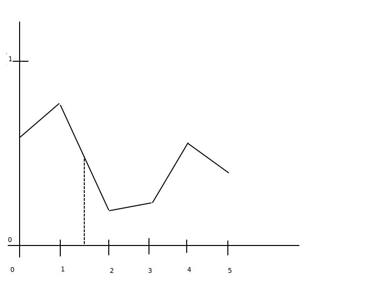
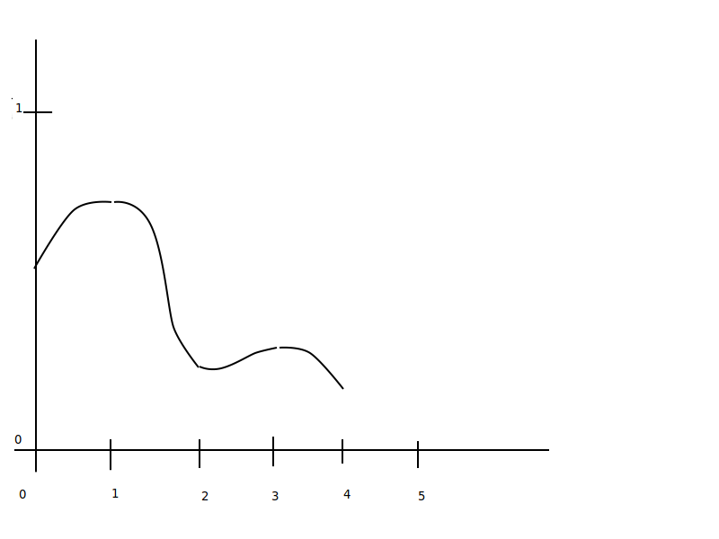
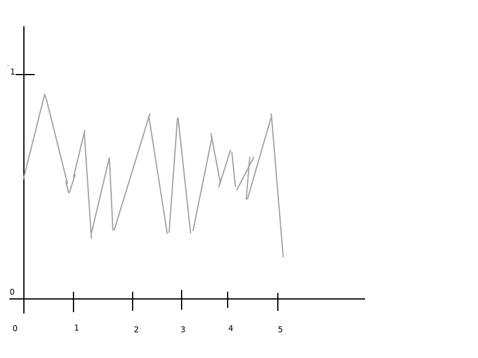
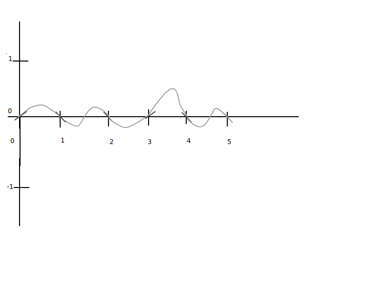

## Terrain Synthesis

### Profile of Mountains


- graph from 0 to 1 on y axis for height
- 0 and on for x axis
- random value for y calculated at integer intervals on x, values between intervals are interpolated
- "value noise": the interpolation (low frequency -- changes slowly)



- Maybe smoother conncections
  - Stitch together with smoother curves
  - rolling hills
  - "value noise" (smoother) (low frequency)


- Rougher mountains? (smaller interval => higher frequency noise)

### Perlin / Band-Limited

- Create 1 dimensional noise
- noise1d(x)
  - y on range -1 to 1
  - at each interval y = 0, but slope is nonzero
  - curve drawn between intervals


- Method:
  - values at integers are zero
  - randomly pick slopes at integers
  - smoothly join between integers
- Properties:
  - frequency is well controlled
  - gives values on [-1, 1], can map to [0,1]
  - high amplitude, low frequency
- create a random height field (triangle mesh)
  - tiles of quads made of huge grid of triangles
  - modify height(z) of vertices to be noise2d(x,z)
- Adding to Perlin:
  - add a low aplitude, high freq to the high amplitude, low freq Perlin
  - Gives a more mountain type
  - `height(x) = noise1d(x) + 0.5 * noise1d(2 * x)`
  - first piece of creating fractal noise
- Fractal Noise
  - `height(x) = noise2d(x, z) + 0.5 * noise2d(2x, 2z) + 0.25 * noise2d(4x, 4z) + ...` 

### Perlin Noise Psuedocode

``` c
float noise1d(float x) {
    float p1 = floor(x);
    float p2 = floor(x) + 1;
    float t = x - p1;
    random.seed(p1);
    float slope1 = random(-1, 1);
    random.seed(p2);
    float slope2 = random(-1, 1);
    return(smooth_interp(slope1, slope2, t))
}
```

### 2D to 3D

- noise is similar
- random slope => random gradients (dx, dy, dz)
- need 4 or 8 gradients for 2D or 3D perlin noise