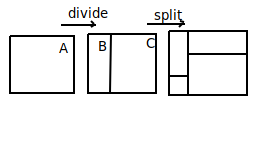

## Streets

### Paths for vehicles

- for things that move
- Open Street Maps: online resource for streets

### Two Street layouts

1. Grid based
2. Free-form

### Grid Based Streets

- regular square grid basic outline of algorithm
- pattern of empty and street squares
- convert to geometry (mesh)
- 2D grid of integers
- ex: steet -> 1, empty -> 0

| 0  | 0  | 1  | 0  |
| --- | ---| --- | --- |
| 0  | 0  | 1  | 0  |
| 1  | 1  | 1  | 1  |

### 5-square template

- straight

| x | 0  | x |
|---| ---|---|
| 1 | 1  | 1 |
| x | 0  | x |

- turn

| x | 0  | x |
|---| ---|---|
| 1 | 1  | 0 |
| x | 1  | x |

- 4 way intersection

| x | 1  | x |
|---| ---|---|
| 1 | 1  | 1 |
| x | 1  | x |

- T junction

| x | 0  | x |
|---| ---|---|
| 1  | 1 | 1 |
| x | 1  | x |

- Dead end

| x | 0  | x |
|---| ---|---|
| 0 | 1  | 0 |
| x | 1  | x |

- Empty

| x | 0  | x |
|---| ---|---|
| 1 | 0  | 0 |
| x | 0  | x |

 

### Shapes of City Blocks

- usually rectangular, not square

### Irregularities

- Perfect grid is unrealistic
- Create irregular Patterns:
  1. modify an initially regular grid
  2. recursive subdivision, with variations as you go

### Modifying Regular Grid

- Start with regular grid, then:
  1. Shift streets left/ right or up/down
  2. Delete some streets
  3. Add steets, bisect existing blocks
  4. Partial deletion, scale a steet down so it dead ends
  5. Vart initial spacing

### Recursive Subdivision

- Create binary (or ) tree of regions
- each region described by mi and max x and y
- Start Region -> divide (bisect in random place)
    -> split both new regions

- On top of this can run previous method

### Further Mods

- varying street width
- special codes for features such as roundabouts