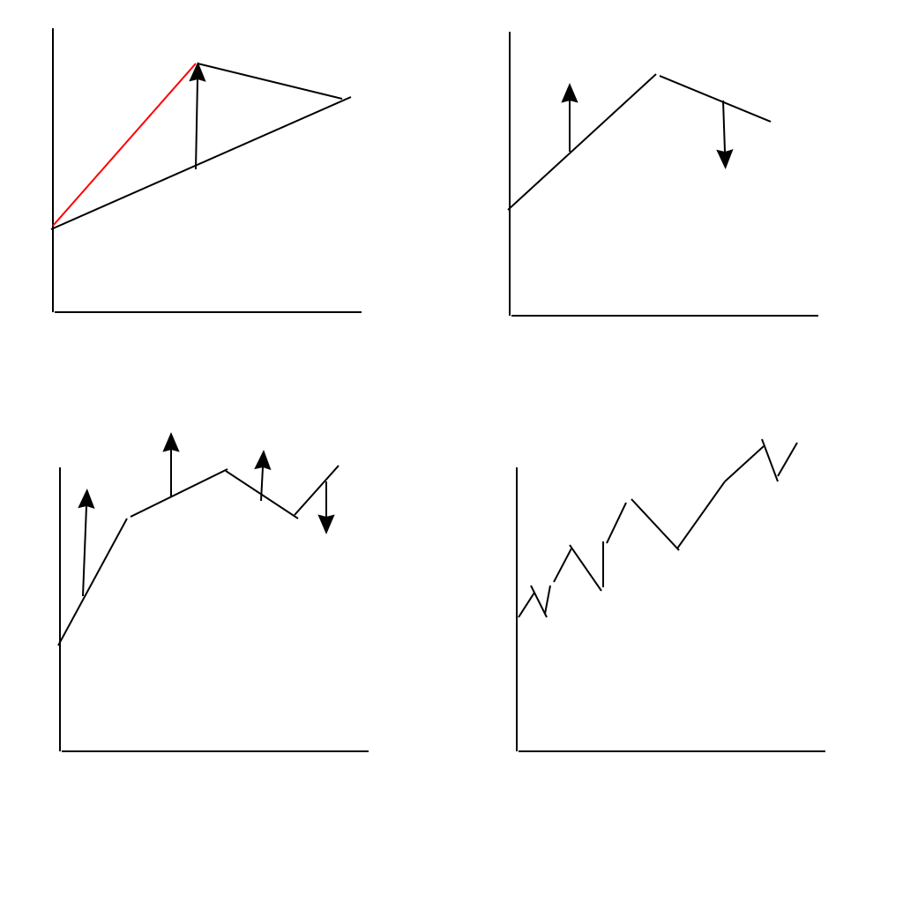
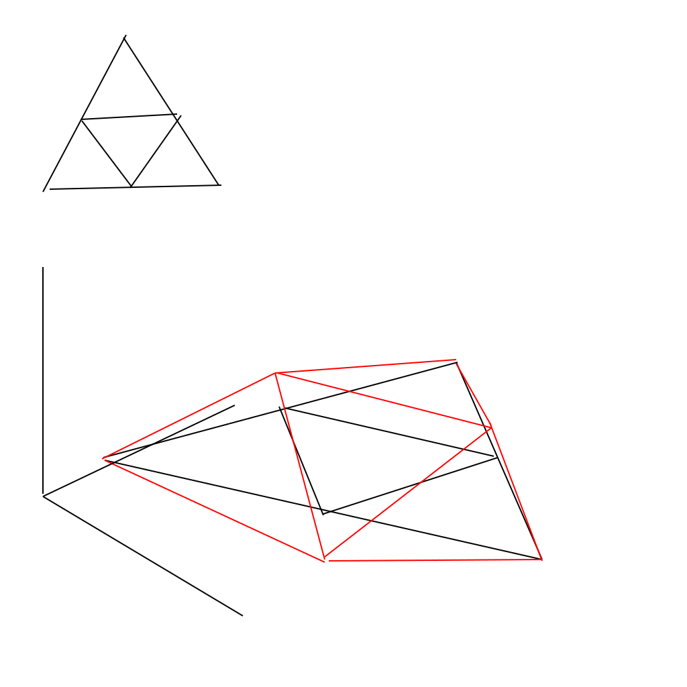
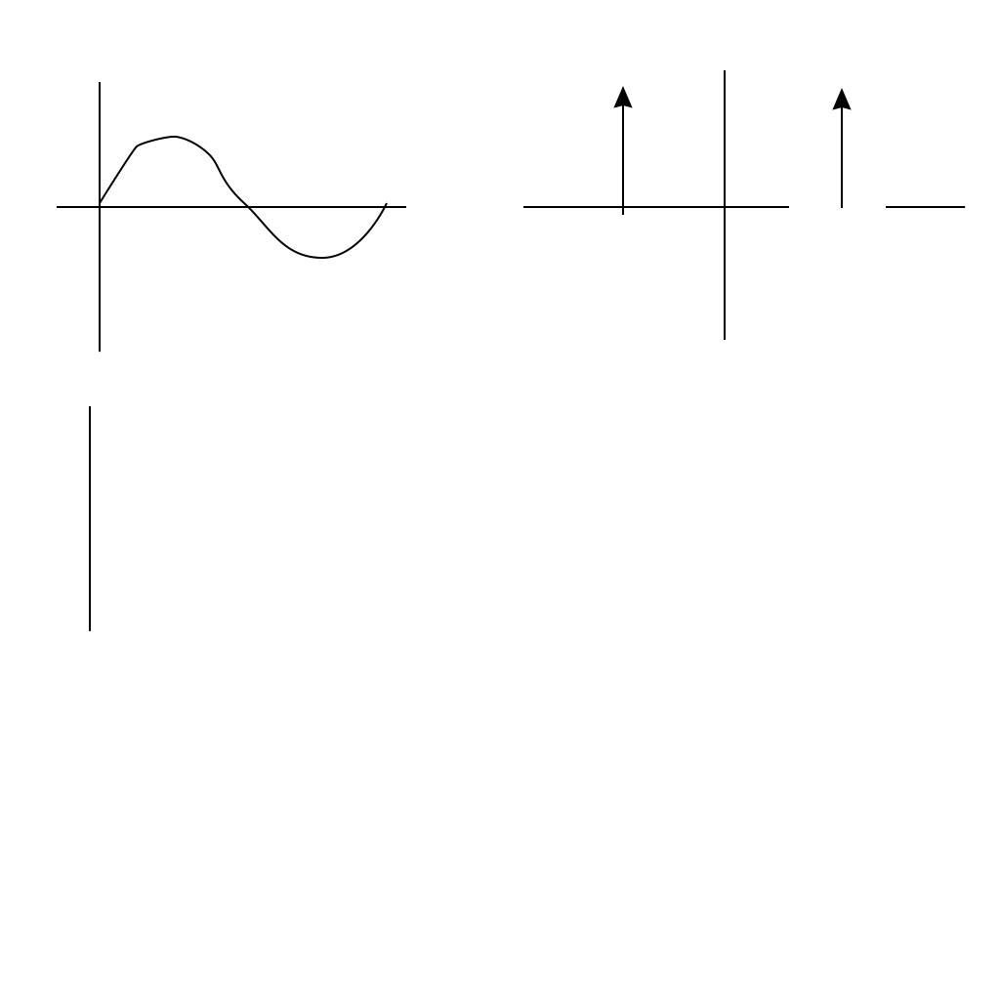

## Terrain Synthesis
- Alternatives to Perlin
- Not recommended for projects

### Carpenter Subdivision
- Midpoint dispacement
- 1D Profile of a fractal

  - Random shifts at midpoints in a range [min, max]
  - add new points at middle of segment
  - shift midpoints random vertical amoint
  - random shifts decrease by 1/2 at each step
- 2D with Triangles

  - smaller triangles made with subdivision
  - new points made at mid points of original triangle
  - shift midpoints in z direction
  - subdivide repeatedly, get fractal triangle mesh
- psuedocode
``` c
void fractal(vector p1, vector p2, vector p3, int range, int depth) {
    if (depth == Max_depth) {
        create_triangle(p1, p2, p3);
    }
    m1 = (p1 + p2) / 2;
    m2 = (p2 + p3) / 2;
    m3 = (p3 + p1) / 2;
    m1.y += random_height(m1.x, m1.z, range);
    m2.y +=
    m3.y +=
    fractal( p1, m1, m3, range * 0.5f, depth + 1);
    fractal( p2, m2, m1, range * 0.5f, depth + 1);
    fractal( p3, m3, m2, range * 0.5f, depth + 1);
    fractal( m1, m2, m3, range * 0.5f, depth + 1);
}
```

``` c
float random_height(int x, int z, int range) {
    int s - (int) (x * prime1 + z * prime2);
    random_seed(s);
    return (random(-range, range);
}
```

- Creases are a problem

### Fourier Transform (FT)
- Sgows frequency content of function
- Spacial domain        -  Frequency domain
cos(x)                      direct delta functions over u

low frequency
- cos(4x)           more spaced out delta functions
higher freq
- white noise
  - spacial
  - freq -> more noise
- noise1d(x)
  - spacial: normal graph
  - freq: band limited noise bw 0.5 and 1
- 0.5noise1d(2x)
  - spatial graph normal but hugs the x axis
  - freq: now band limited bewteen 1 and 2 on u axis
- `fractal(x) = noise1d(x) _ 0.5*noise1d(2x) + 0.25*noise1(4x) + ...`
  - frequency follows close to a `1 / u` hyperbola
  - `fractal noise = 1 / f` noise
- Richard Voss
  - Take white noise and -> FT
  - Now `1 / u` scaled and then apply FT^(-1)
  - gives `1 / f` fractal noise