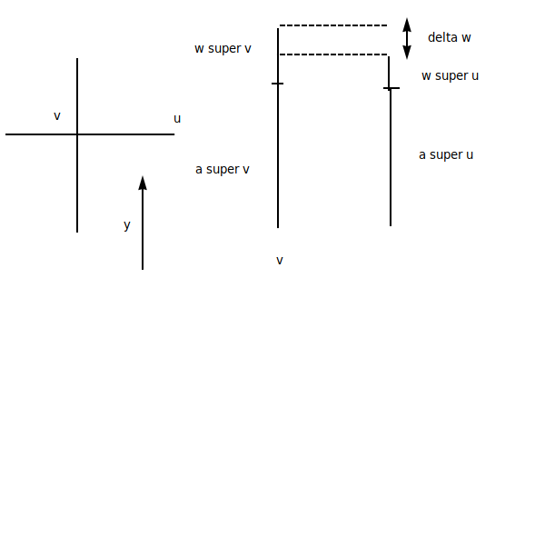

## Terrain Erosion

- pulling from teh "The Synthesis and Rendering of Eroded Fractal Terrain"
  - Musgrave, Kolb, Mace
  - Siggraph 1989

### Categories
- thermal
  - material knocked off, piling up below
- wind
- glaciers
- hydraulic
  - rain, rivers

### High Level Steps
- create fractal height field on a regular grid
  - eg Perlin noise band sums
- deposit water at random locations
- water flows downhill
- fast-moving water picks up sediment
- slow-moving water deposits sediment

### View of Process
- vertices have different heights
- height field
  - z and x axis
- side view
  - y and x axis
  - flow of water
- Each vertex v has info:
  - altitude (av)
  - water amount (wv)
  - sediment in water (sv)
- Vertex neighbors
 - each vertex has 4 neighbors
 - amount of water passed from v to u:

- Δw = min(wv, (wv + av) - (wu + au))

- if delta w > 0
    - // water moves from v to u
    - wvt + 1 = wvt - Δw
    - wut + 1 = wut + Δw
    - // may pick up sediment
- else
    - avt + l = avt + Kd * svt 
      - // deposit sediment at v (increase altitude)
    - svt + 1 = (1 - Kd) * svt
      - // remove sediment from water
    - // more equations guiding sediment motion

- K sub d: how gast sediment can be deposited
- K sub C: how much sediment water can carry
- K sub S: how easy it is for water to pick up soil (soil softness)

- Results:
  - water carves channels in terrain
  - sediment picked up on steep slopes
  - sediment deposited in flat areas (down below)

### Starting on Project 1
- Just make a grid
- draw the triangles
- modify y, `y = Mathf.PerlinNoise(x, z);`
- Handle (u,v) coordinates for colors
  - keep in range [0, 1] for ease
  - last vertex in x direction (u, v) = (1, 0)
  - last vertex  in y direction (u, v) = (0, 1)