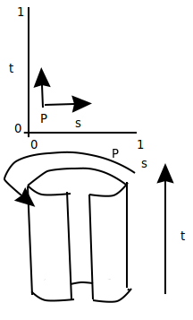
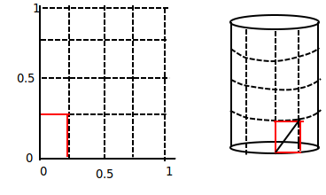
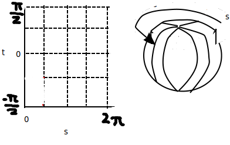
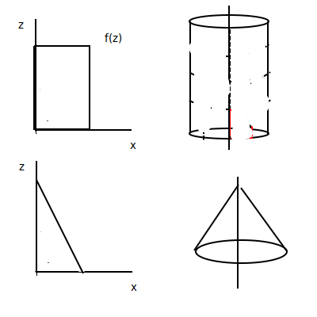

## Parametric Surfaces 

### Parametric Curve Revisit
- Circle can be contructed from changing a singular parameter θ
- `0 <= θ =< 2π`
- `f(θ) = [x(θ), y(θ)]`

### Cylinder

- 2D Parameter Space: t on 0 to 1 by s from 0 to 2π
- "Rolling up the parameter space into 3D"  

- `x(s, t) = cos(s)`
- `y(s, t) = sin(s)`
- `z(s, t) = t - hieght`
- `f(s, t) = [x(s, t), y(s, t), z(s, t)]`
- (s, t) in 2D parameter space map to (x, y, z) in 3D space

### Isoparametric Line

- 2D parameter space grid from 0 to 1
- moving along graph, move along 3d object

- Tesselation (or tiling) of a cylinder

### Parametric Sphere

- `x(s, t) = cos(t) * cos(s)`
- `y(s, t) = cos(t) * sin(s)`
- `z(s, t) = sin(s)`

## Surfaces of Revolution

- 2D profiles rotated around axis of revolution to form 3D shapes

- Rectangle => cylinder
- Triangle => cone
- Half circle => sphere
- Circle => torus

## Textures

- texture space, v from 0 to 1 by u from 0 to 1
- each vertex gets a (u,v) texture coordinate
- (u, v) are usually proportionate to (s, t)
- Translating the color at a location in the texture to a location on the object in 3D
