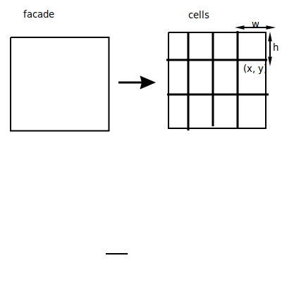
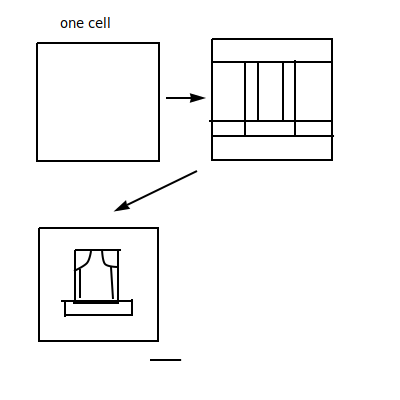

## Buildings 1: Facades

- Many CG buildings:
  - ignore interiors (rooms, furniture, plumbing)
  - have opaque windows
  - use textures as replacement for detailed geometry

- Kinds of buildings
  - log cabins
  - swiss chalet
  - brick houses
  - apartment blocks
  - skyscrapers

### Building Components

1. Overall Shape
2. Facad (windows and doors)

- Simplifying assumptions
  - facades are rectangles
  - doors + windows are flat against the wall

### Approach 1
- Divide facade into 2D grids of cells
- each cell remembers attributes (eg windows type, paint color, isdoor, door size)
- Convert cells into a textured quad

#### Facade to cells
- each row of cells is a separate floor
- Column of cells are aligned windows
- Number of cells based on facade width + height

#### Cell info
  - width, height, position(x, y)
  - attributes (eg, blank wall, window type, wall color)

#### Rules to give cells Attributes
- Mark one ground floor cell as door
- randomly pick window types
- window in some row or column is same type

#### Convert Cells into textured Quads
- quads for cell will exactly fill its 2d area
- may have several "blank" quads

### "Instant Architecture"
- Wonka, Wimmer, Sillion, Ribovsky
- Siggraph 2003

- Buildings are collections of basic shapes, blocks
- Define a split grammar
- Rules of grammar change blocks into smaller blocks
- Two types of blocks at a high level
  - non terminal (will change)
  - terminal (no more change to that block, used in final model)
- Ex

#### Blocas have attributes:
- Uses:
  - specify materials and colors
  - steer the choice of rules

### "Procedural Modeling of Buildings"
- Muller, Wonka
- Siggraph 2006
- more complex complete grammars

### "Procedural Modeling of Cities"
- Parish, Muller