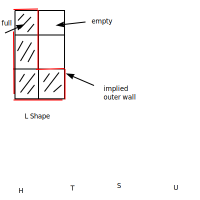
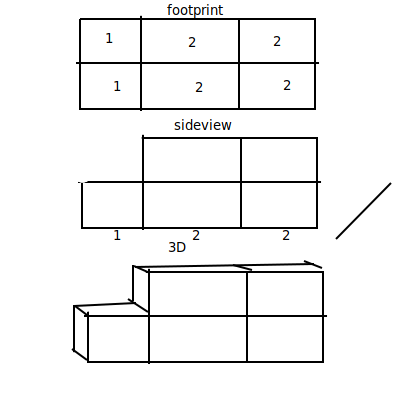
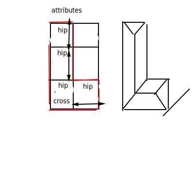
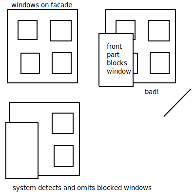
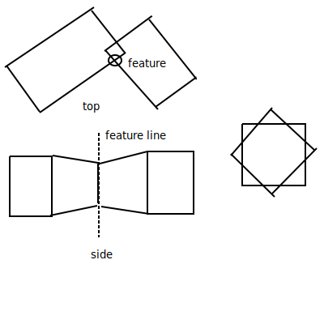

## Building Synthesis 2

### Building Components:
- 3d shapes
  - footprint (top view / foundation)
  - vertical profile (side view)
  - roofs
- facade elements
  - windows
  - doors

### Building Suggestions
- Simplification
  - footrprint
    - represented of <u>same-sized</u> rectangles
  - Grids

- Approach:
  - Represent as a pattern of 2d grid cells
  - cells can be empty or full
  - cells represent <u>large</u> house components
    - not small minecraft 1m blocks
### Footprint  

### Vertical Profile (side)
  - assigned cells with integer height

### Roof
- gabble, hip, cross-gable
- cross-hipped, gambrel, mansard
- use some id to differentiate types

### Paper: "Procedural Modeling of Buildings"
- Muller, et al
- Siggraph 2006

- Grammar for facades
  - (replace one shape with other shapes)
  - ex row --> repeat{tile}
  - | row | --> | t | t | t |

- Problem 

- can handle intersection and objects with same position, but different orientation

### Two techniques to handle collisions
- identify occlusions (objct in front of another)
- snap to nearby lines

### Identify Occlusions
- grammar rules can include occlusion generics
- left hal of rules can check for occlusions
- results of rule: none, partial, full
- EX
  - tile : occlude == none -> window
  - tile : occlude == partial -> wall
  - tile : occulde == full -> epsilon (no geomtry)

### Snap
- create feature lines where shapes meet
- grammar can "snap" features during subdivision

### Subdivision
