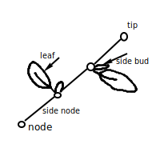
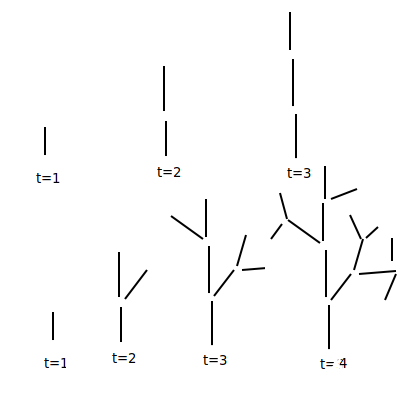
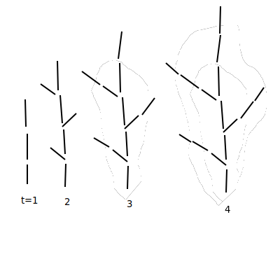
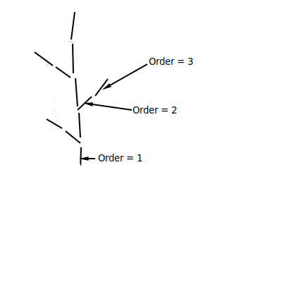
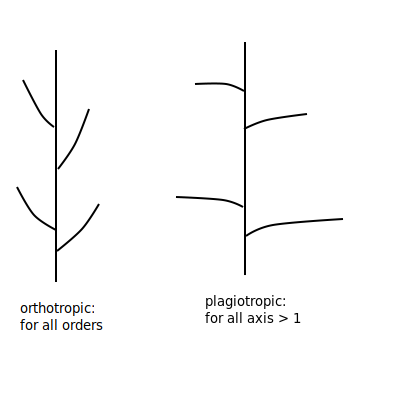
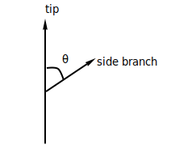
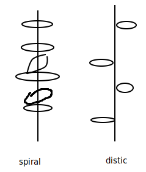
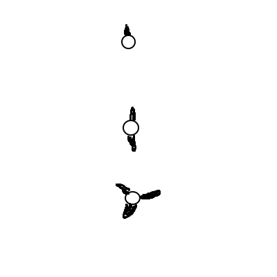

## Woody Plants

- shrubs, bushes, trees

### "Tropical Trees and Forests"
- Halle, Oldeman, Tomlinson
- Sptringer-Vorlog, 1978

### Architecture of the tree: 
- pattern of branching
- Grow in modular way


- Terminology
  - node
  - internode
  - leaf
  - side (auxillary) bud
  - tip or apical bud
  - trunk or branch can lengthen at tip node
  - lengthening: growing new internodes, leaf, side bud
- new branch can form at side buds

- In Temperate zones (like US) side buds do <u>not</u> grow right away.


### Fates of Buds
1. produce new internode
   - bud
   - leaf
2. Pause growth (dormant until next year)
3. Die
4. Produce flower

- "Plant Models Faithful to Botanical Structure and Development"
- deReffye et al.
- Siggraph 1988

### Data Structures
- node:
  - position (x, y, z)
  - list of buds
- internode:
  - node1, node2
- bud:
  - direction (dx, dy, dz)
  - die_prob
  - pause_prob
  - age
  - order

### Bud Property Details
- Each node given 2 probabilities:
  - die (chance of dying)
  - pause (chance of node pausing)
- Axis Order:
  - axis = trunk or branch


### Growth algorithm
``` c
for each live bud:
    if (random() < bud.die_prob)
        bud.set_dead();
    else if (random() > bud.pause_prob) {
        create_internode(bud);
        create_tip_bud(bud);
        create_side_bud(bud);
    }
``` 

### Grow Types
- orthotropic - tendency to grow vertically (up)
- plagiotropic - tendency to grow horizontally (sideways, out)


### Branching Angle


### Bud pattern around axis
- spiral
- alternating (distic)



### Multiple buds at Nodes


