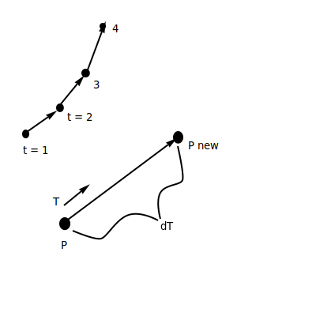
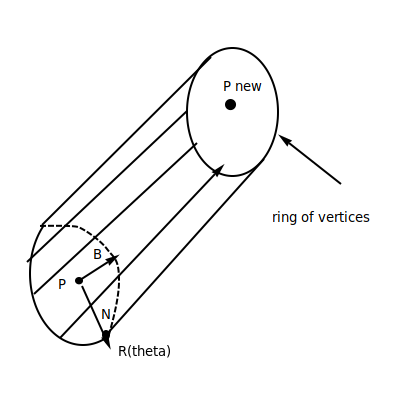
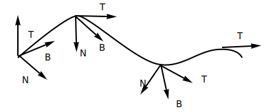
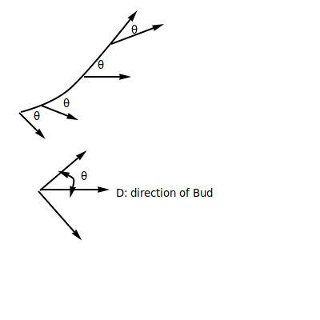
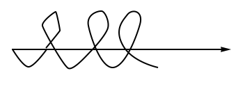
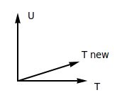
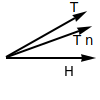
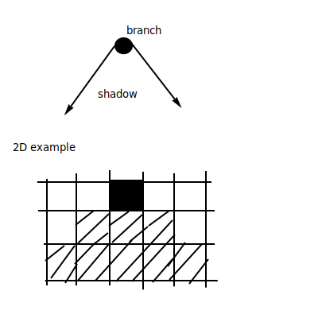

## Plant Geometry II

### Math Review
- Vector `V = (x, y, z)`
- Length of V: L = ||V|| = sqrt(x2 + y2 + z2)
- Unit Vector: length = 1
  - V hat = V / ||V|| = (x / L, y / L, z / L)
  - ||V hat || = 1
- Cross Product
  - C = A x B
  - C is a vector perpendicular to A and B

### Growing Branch
- position P
- direction T "tangent"
- new Position Pnew = P + dT
  - d is the distance of growth
- 

### Create a tube of Quads
- around P and Pnew
- 

### We need coordinate Frame
- Need a normal vector N
- Need another normal, binormal B
- Need the tangent T
- T, N and B are all orthogonal
- 
- N = (1, 0, 0)
- B = (0, 1, 0)
- Q(theta) = (cos the, sin the)
- Q(the) = N cos the + B sin the
- R(the) = P + N cos the + B sin the
- If branch curves, need to update T, N and B
  - Tnew = T / ||T||, make unit length
  - B = Tnew x N / ||T x N||, makes B perp T, B unit Length
  - N = B x T, makes N perp B, N perp T, N unity length

### Place Buds in plane of T and N
- Bud Direction:
  - D = T cos θ + N sin θ
  - 
- Buds Spiral around branch
  - We will rotate N and B around growing direction T
  - 
  - Rotate N by angle phi : Nnew = N cos phi + B sin phi
  - Bnew = T x Nnew

### Randomness in Branch Growth:
- Trand `= (x + d * rand(), y + d * rand(), z + d * rand())`
- Tnew = normalize(Trand)

### Orthotropic Growth
- tending to grow up
- Strategy: mix current direction (T) with up direction (u)
- u = (0, 1, 0) (y axis in Unity)
- Tnew = norm(T + k * u), where k is small scalar
- 

### Plagiotropic growuth
- grows out (in xz plane)
- Need a horizontal vector in similar direction to T
- T = (xT, yT, zT)
- Htemp = (xT, 0, zT)
- H = norm(Htemp)
- Tnew = norm(T + k * H), where k is small
- 

### "Self Organizing Tree Model for Image Synthesis"
- Prusinkiewicz et al., Siggraph 2009

### Observations on Tree Growth:
- energy is gathered from sun exposure
- most growth is at non-shaded branches
- branches should avoid each other
- Estimate Sun Exposure
- 
- Approx in 3D with a grid
- Do this for all parts of all branches
- Get per cell sun amount 
- Assign light quantity Q per <u>bud</u>
