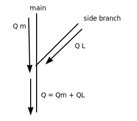
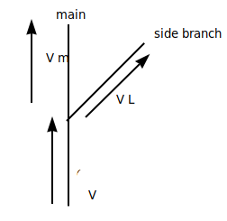
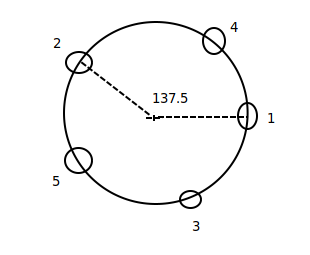
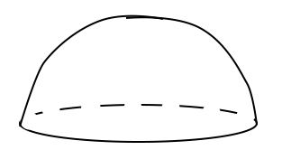
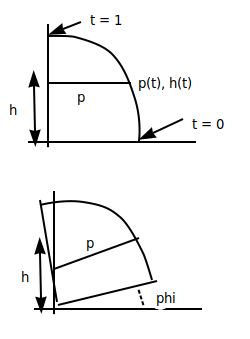
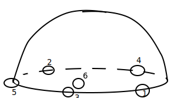

## 

### Papers
1. Self-Organizing Tree Models
2. A Collision-Based Model of Spiral Phillataxis
  - Fowler, Prisinkiewicz, Battjes
  - Siggraph 1992

### Esitmating Sun Exposure
- Q values
- each bud gets one

### Growth at Buds
1. Calculate per bud Q
2. Sum all light energy
3. Resources redistributed to different buds
4. Grow buds based on distributed resources

### Summing Light Energy
- Main branch and lateral branches
- Final sum at base
- 

### Redistribute Energy (upward flow)
- v = resources
- 
- VM = V * (λ * QM) / (λ * QM + (1 - λ) * QL)
- VL = V * (1 - λ * QL) / (λ * QM + (1 - λ) * QL)
- Lambda:
  - λ > 0.5 Main Branch dominates
  - λ = 0.5 Equal distribution
  - λ < 0.5 Lateral branches dominate

### Spirals
- Rotating nodes at 137.5 degrees
- 
- Base "Receptical"
- 2D Profile, (rotate it)
- 
- Cylindrical coordinates (p h, ϕ (phi))
- 
- 2D arc example

### Position of Buds
- based on values
- primordia
- First bud:
  - `ϕ`0 = 0
  - `t`0 = 0
- Next angle = `ϕ`n + 1 + 137.5 degrees
- Next `t` ( `t`n+1 ) - determined from overlap status
  - `t`n+1 is smallest `t` st, for all ealier buds, i = 0, 1, ..., n of radius `r`i,
  - dist( P(`ϕ`i, `t`i, P(`ϕ`n+1, `t`)) >= `r`i + `r`n+1
- 