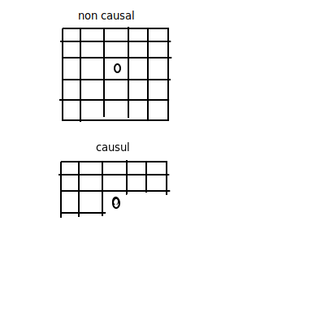
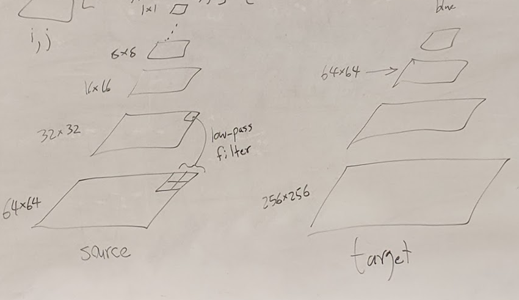

## Texture Synthesis

### Example-Based Texture Synthesis
- Source Image
  - Given to you
  - Smaller, sometimes even 64x64
- Target Image
  - larger

### Pixel Neighborhoods
- Region around a given pixel
- example 5x5 grid (non causal)
- dist(N, N2)
  - comparing numerically

### Algorithm
- Initialize target by randomly copying pixels from source
- For each pixel (x,y) in target
    - Build neightborhood Nt around (x,y)
    - Dbest = big 
    - Cbest = null
    - For each pixel x', y' in source
        - Build neighbor NS around x',y'
        - if (dist(NS, Nt) < - Dbest)
            - Dbest = dist(NS, - Nt)
            - Cbest = source_color(x', y')
    - target_color(x, y) = Cbest
- Use toroidal wrapping to take care of edges
- dist(NS, Nt) = sum of squared differences
- 

### Fixes
- 5x5 causal neighborhood
  - 

### Image Pyramid
- Big at the base down to a pixel
- Average colors down into smaller images
- Low Pass filter: Gaussian blur/filter image then sample every other pixel into smaller image.
- 

### New Pyramid Algorithm
- copy random pixels source -> target
- perform 1 level synthesis at level k
- for level = k -1 down to 0
  - perform synthesis with 2 levels of pyramid
  - (One non causal at K and one causal at K-1)
- 

### Generated texture on a surface
- finding points along the model
- vector fields

### Papers
- "Fast Texture Synthesis using Tree-Structured Vector Quantization"
- Li-Yi Wei, Marc Levoy
- Siggraph 2000