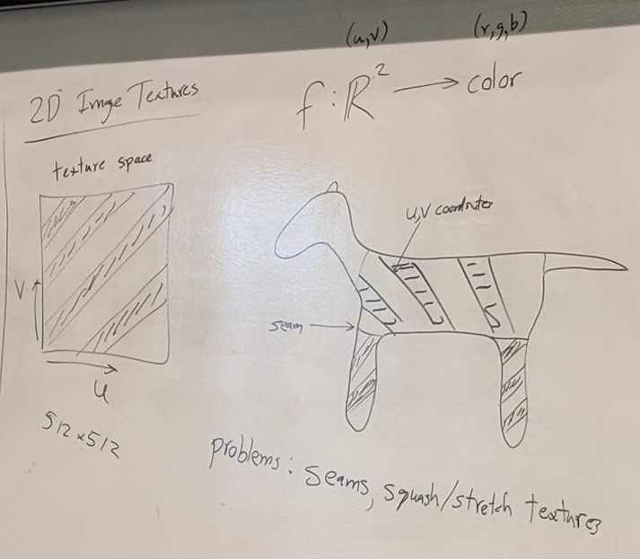
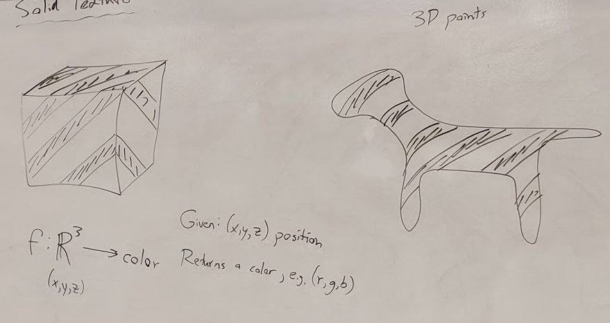
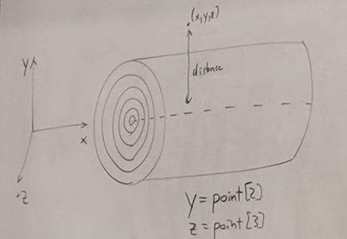
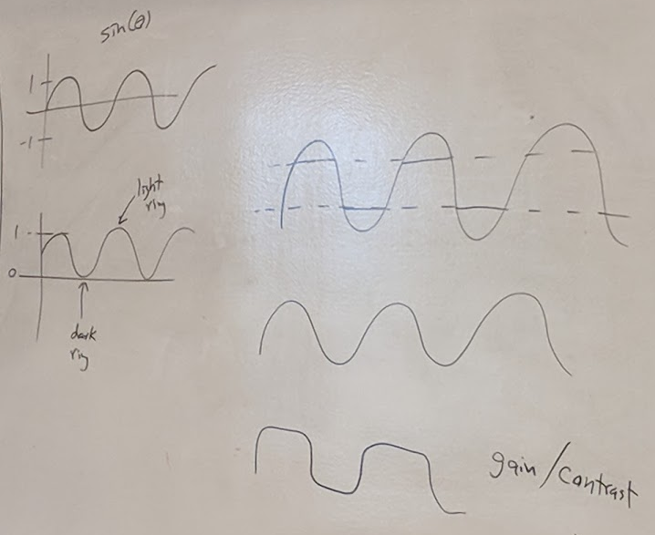
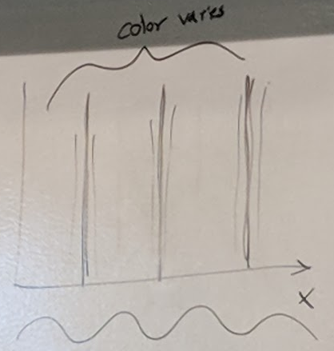

## Perlin Texture Synthesis

### 3 Ideas:
- Shading language
  - Rob Cook originated
- Solid Texture
  - Coinvented: Darwyn Peach, Geoffry Gardner
- Noise Function
  - all from Perlin

### Shadin Language
- Special purpose language
- calculation of light/color at a surface
  - diffuse c = c<sub>l</sub> c<sub>r</sub> (N * L)
- Also procedural textures
- Exmples:
  - Renderman shading language
  - GLSL
  - HLSL
- Perlin's: Pixel Stream Editor

### Flow of Information
- Inputs
  - objects
  - matrials
  - light
- `| Goes into |`
- Renderer
  - (Hiden surface calculation)
- `| Goes into |`
- Some Unit (Texels maybe)
  - Points in 3D
  - Pixel locations
  - normals
  - object id's
- `| Goes into |`
- PSE
- `| Goes into |`
- colors per pixel
  - final image

- Example
```
if surface == 1
    color=[1 0 0]*max(0.1,dot(normal, light))
else
    colro=[0 0 0.1]
```

- EX Object at origin, half red / half green, light = [1 0 0]
```
x = point[1]
if x > 0
    color = [1 0 0]
else
    color = [0 1 0]
color *= max(0.1, dot(normal, light))
```

### 2D image textures
- 
- Problems: Seams, squash/strech textures

### Solid Texture
- Represented as a piece of code
- 
- f: R<sup>3</sup> -> color
- Given an (x,y,z) position
- solid texture function returns a color

### Wood Example

- 
```
y = point[2]
z = point [3]
distance = sqrt(y * y + z + z)
color = [light brown]*(1 + sin(distance))*0.5
```
- Can use gain/contrast to modify curve
- 
- Options:
  - Modify y and z to distort pattern to not be perfect circles using noise
  - Modify colors to have variation


### More Examples
- Spotted Donut:
```
color = white * noise(point)
```
- Bozo Donut:
```
color = Colorful(noise(k * point))
function color(n)
    if n < 0.25
        return [1 1 1]
    else if n < 0.5
        return [1 0 0]
    else if n < 0.75
        return [0 1 0]
    else if n < 1
        return [0 0 1]
```
- Bumpy Donut (bump mapping)
```
normal += Dnoise(point)
normalize(normal)
```
- Marble:
```
function boringMarble(point)
    x = point[1]
    return marble_color_of(sin(x))
```
- 
```
function marble(point)
    x = point[1] + turbulence(point)
    return marble_color_of(sin(x))

### Paper
- "An Image Synthesizer"
- Ken Perlin
- Siggraph 1985