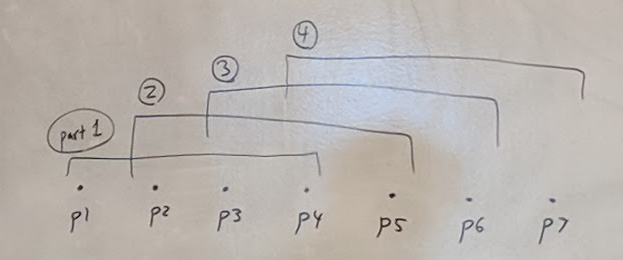
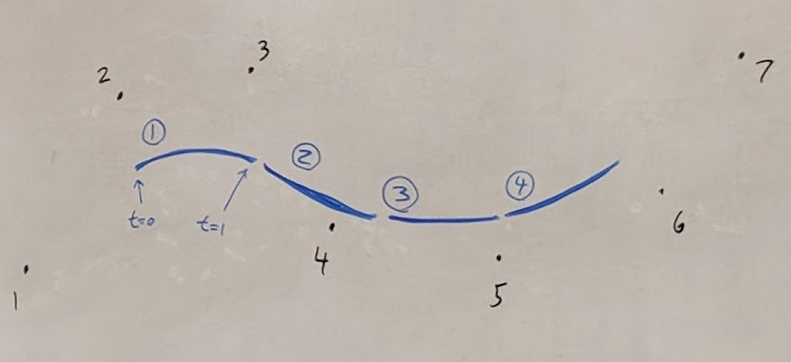
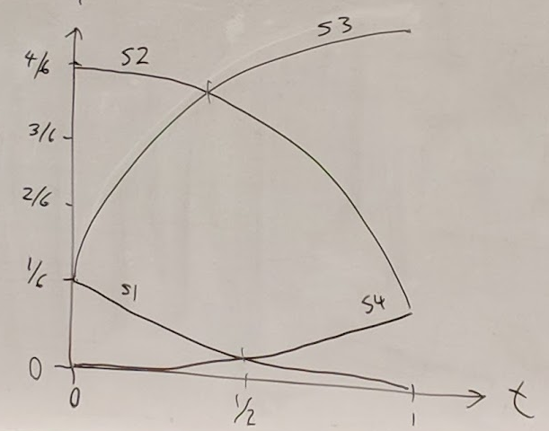
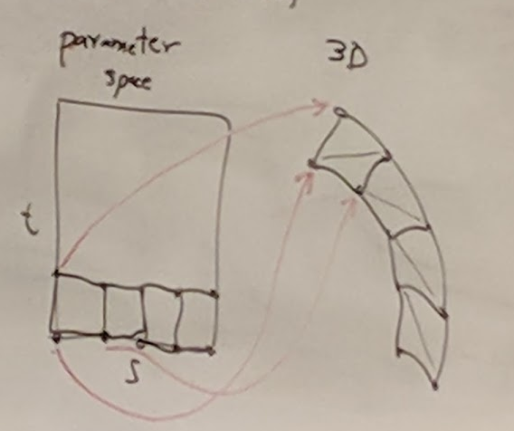
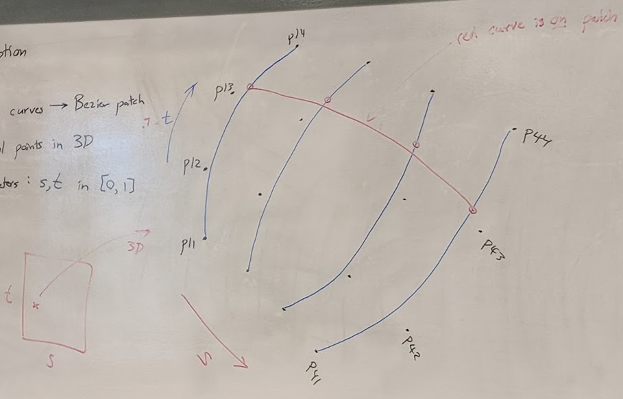

## One more curve representation

### B-splines
- Properties:
  - Smoother than Bezier curves
  - Use (possibly) long list of control points
  - Curve does <u>not</u> pass through any control points
- A family of curves

### "Sliding Window" of control points
- 4 points at a time
- 
- 

### Cubic B-Spline Functions (4)
- S1(t) = 1/6 (1 - t)<sup>3</sup>
- S2(t) = 1/6 (3t<sup>3</sup> - 6t<sup>2</sup> + 4)
- S3(t) = 1/6 (-3t<sup>3</sup> + 3t<sup>2</sup> + 1)
- S4(t) = 1/6 t<sup>3</sup>
- 

### Better Bezier code
``` c
Vector3[] Bezier(Vector3 P1, P2, P3, P4, int num) {
    Vector3[] P = new Vector3[n];
    for (int i = 0; i <= n; i++) {
        t = i / (float) n;
        P[i].x = B1(t)*P1.x + B2(t)*P2.x + B3(t)*P3.x + B4(t)*P4.x;
        P[i].y = (similar);
        P[i].z = (similar);
    }
    return P;
}
```

### Cubic Bezier Surface Patches
- Bezier-ception
- 4 Bezier Curves -> Bezier Patch
- 16 control points in 3D
- 2 parameters: s,t in [0,1]
- going from parameter space into 3D
- 
- everything on red line is on final patch
- not so much for blue
- 

### Steps
1. Create 4 bezier curves G1, G2, G3, G4
2. calculate 4 points on the curves G1(t), G2(t), etc
3. Create one new Bezier curve Q from those 4 points
4. Calculate point Q(s) on that curve
- Q is point on Bezier Patch

### Psuedocode
``` c
Vector3[] Bezier_Patch(Vector3[,] cp, int n) {
    Vector3[] G1 = Bezier(cp[0][0], cp[0][1], cp[0][2], cp[0][3], n);
    Vector3[] G2 = Bezier(cp[1][0], cp[1][1], cp[1][2], cp[1][3], n);
    Vector3[] G3 = Bezier(cp[2][0], cp[2][1], cp[2][2], cp[2][3], n);
    Vector3[] G4 = Bezier(cp[3][0], cp[3][1], cp[3][2], cp[3][3], n);
    Vector3 [] Q = new Vector3(n * n);
    for(int j = 0; j <= n; j++) {
        s = j / (float) n;
        Vector3 P = Bezier(G1[j], G2[j], G3[j], G4[j], n)
        // Copy into Q
        for (int i = 0; i <= n; i++) {
            Q[i+j*n] = P[i];
        }
    }
    return Q;
}
```