## Subdivision Surfaces
- Turns <u>any</u> polygon mesh into smooth surface
- triangles, quads, pentagons, etc
- continuity comes "for free"
- easy to program

### Subdivision Algorithms

### Loop Subdivision
- C2 continuous nearly everywhere
  - but not when valence /= 6, "extradordinary vertices"
- 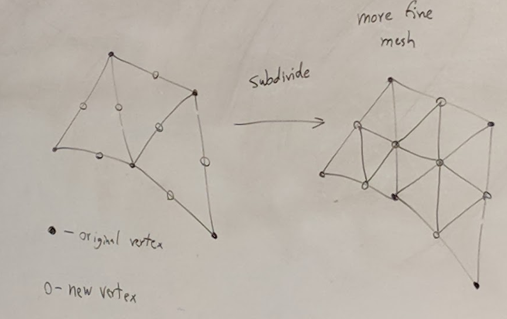
- Algorithm
  1. compute locations of new vertices (per edge)
  2. move positions of old vertices too
  3. make smaller triangles (1 -> 4)

### New vertex for an edge
- 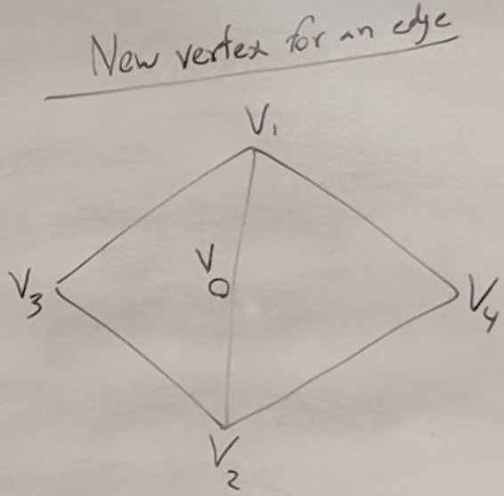
- V = 3/8(V1 + V2) + 1/8(V3) + V4)
- Valence is # of faces adjacent to a vertex
- Valence K original vertex
- 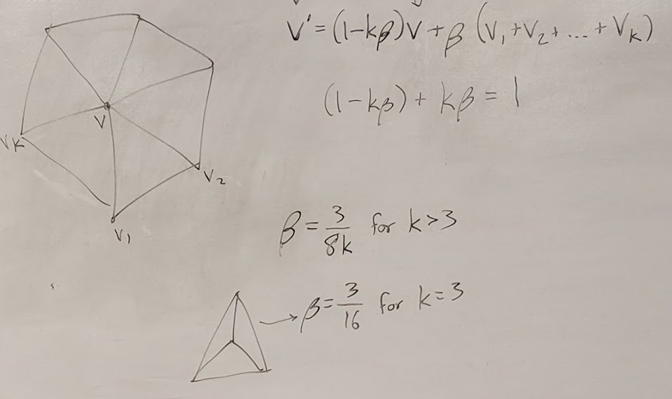
- V' = (1 - K * β) v + β (V1 + V2 + ... + Vk)
- (1 - Kβ) + kβ = 1
- β = 3 / (8k) for k > 3
- β = 3 / (16) for k = 3

### Catmull-Clark (mostly quads)
- old vertices
- new vertex on edge
- new at face
- 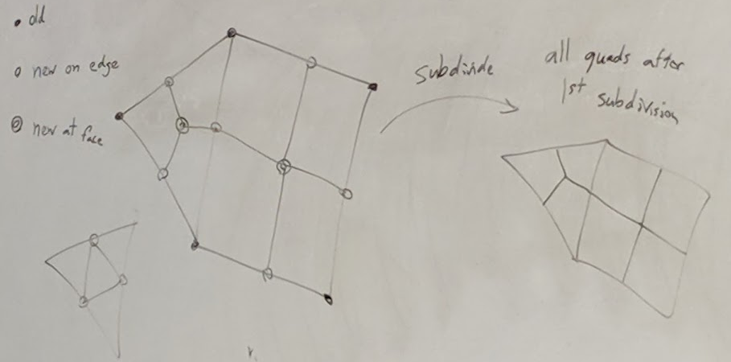
- After subdivide, split one quad into 4
  - New vertex for face (quads)
    - Centroid of face
    - v = 1/4(V1 + V2 + V3 + V4)
    - 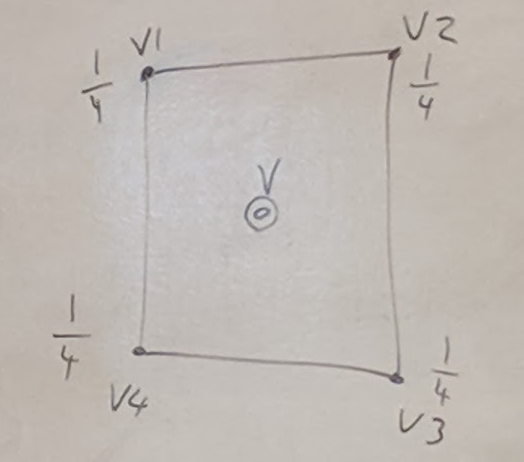
  - Non quad case: (k-gon)
    - v = 1/k * sum of Vi from i = 0 to k
    - 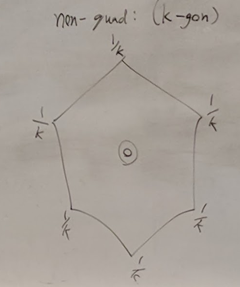
  - Vertex of edge (2 quads)
    - 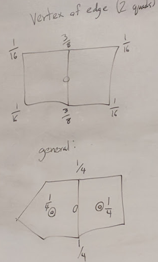
- Move old vertices
  - Let E = 1 / k (e1 + e2 + ... + ek)
  - F = 1 / k (f1 + f2 + ... + fk)
  - v' = E / k + F / k + (v (k - 2)) / k
  - 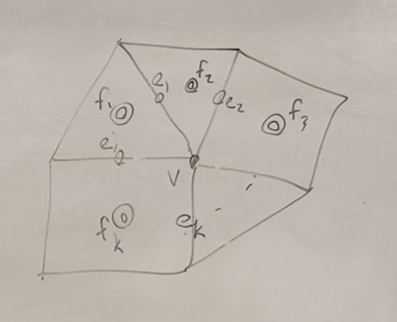
- tag edges to be sharp
  - sharp edge vertex:
    - 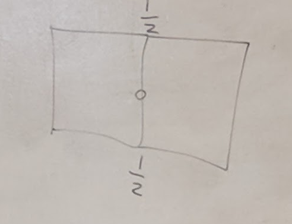
  - vertex with 2 sharp edges
    - v' = (6v + v1 + v2) / 8
    - 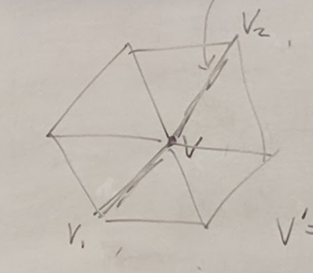 
- Semi sharp edges
  - 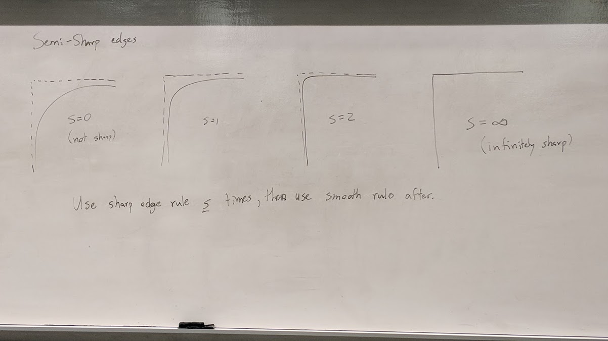
  - Use sharp edge rule <u>s</u>, the use smooth rule after