## Implicit Surfaces

- Accurately measuring distances
- Distance between P and Q
- d = sqrt((x - x')2 + (y - y')2 + (z - z')2) = ||P - Q||
### Implicit Circle
- f(p) = r2 - ||p - c||2
- 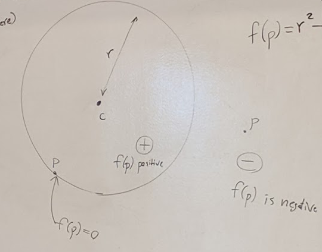
- f(p) = 0 ; on the circle
- f(p) > 0 ; within circle
- f(p) < 0 ; outside circle
- 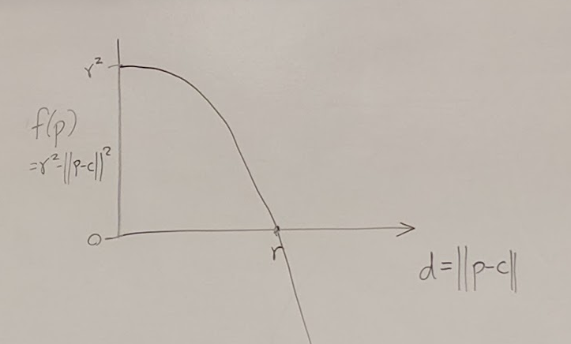
- 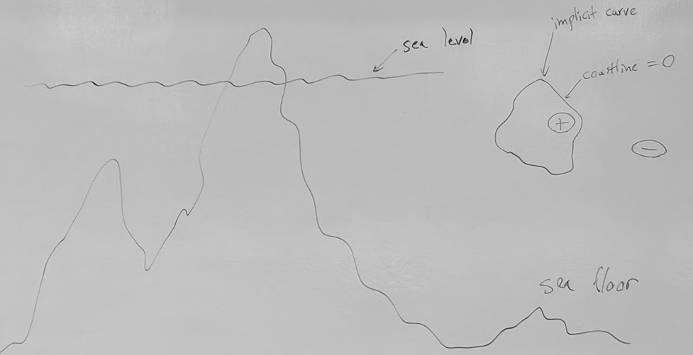

### Blobby Molecules
- Let d be distance to an object
- d = ||p - c||
- **Blynn**
  - g(d) = e-d2
  - 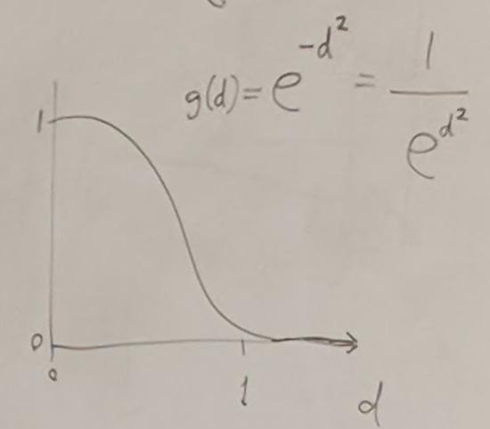
- **Wyvill**
  - g(d) = (1 - d2)3
  - 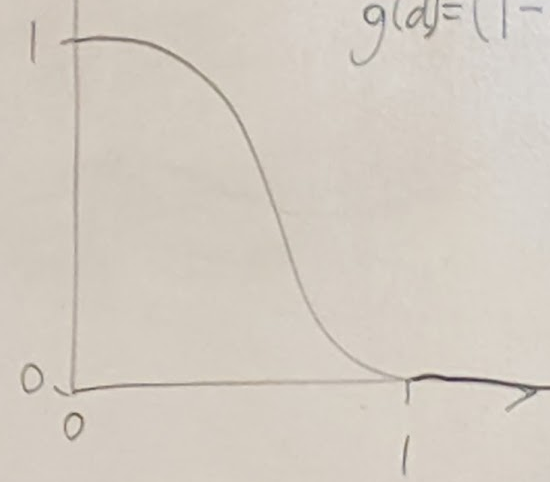
- Create implicit functions for 2 points
  - f1(p) = g(||p - c1) or g(d1(p))
  - f2(p) = g(||p - c2||)
  - Can form sum:
    - f(p) = T - [f1(p) + f2(p)]
  - 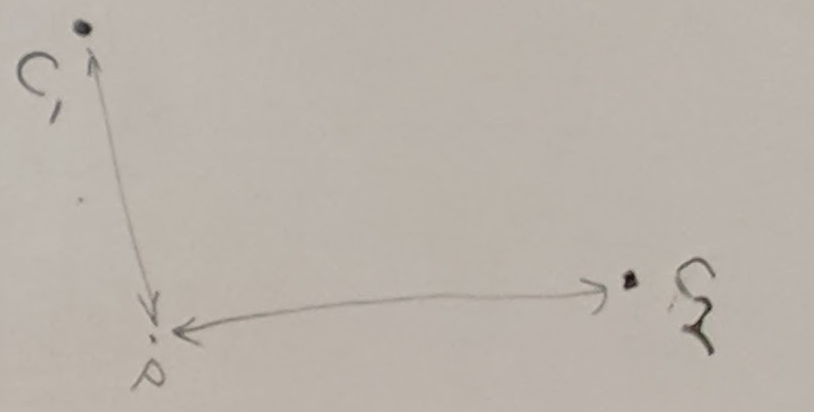
  - **Close together**
  - 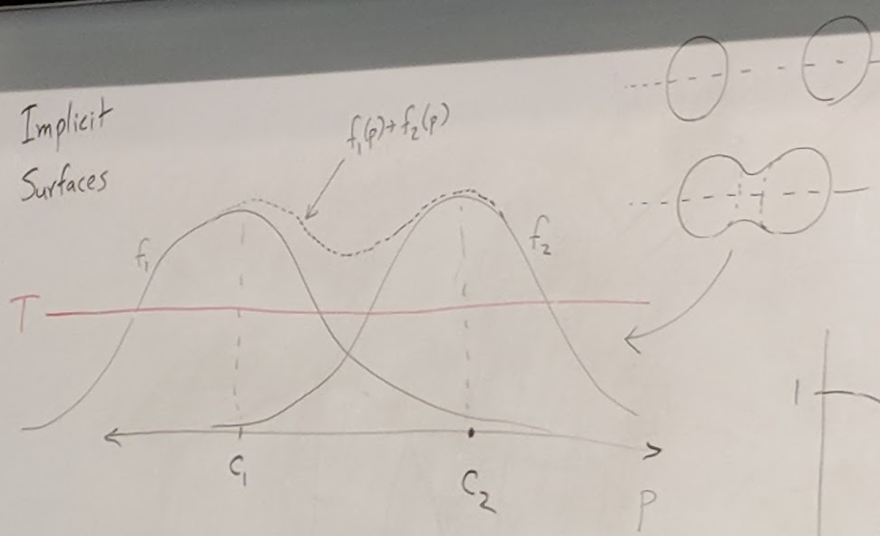
  - Thresholding
    - Everything bigger than T is inside the object
  - Side diagram: as c's move together curves become closer and shapes merge
  - **Farther apart**
  - 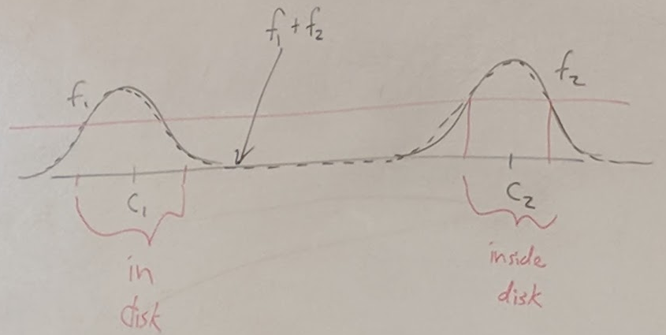

### Blobby line segment
- f1(p) = g(d1(p))
- 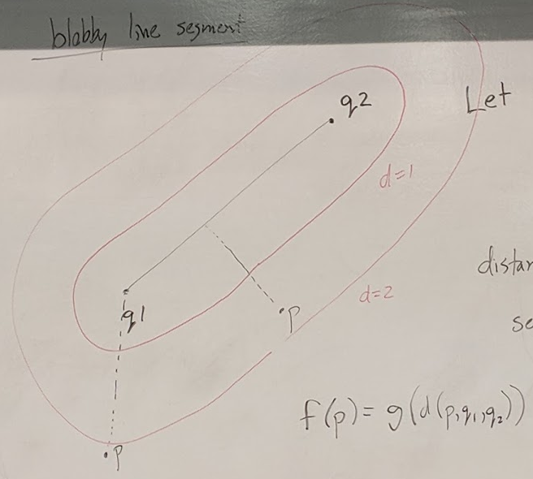
- Let
- 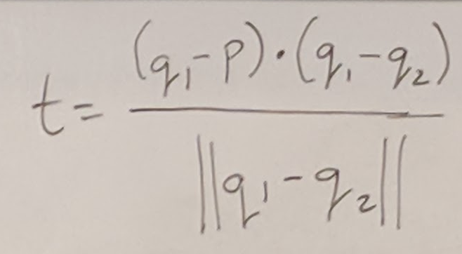
- distance to segment: d(p) =
- 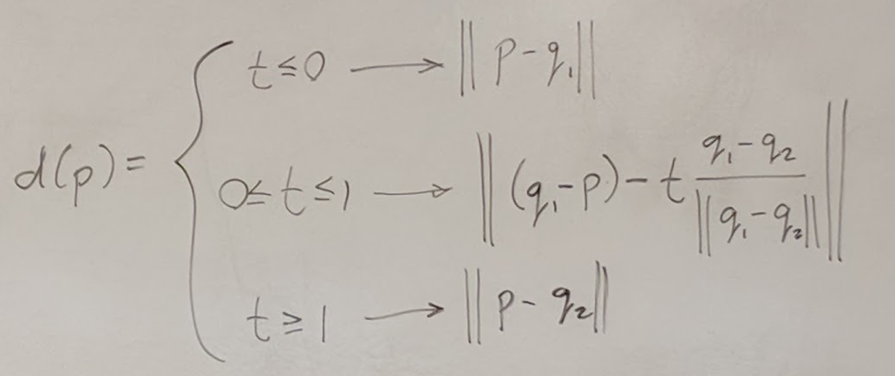