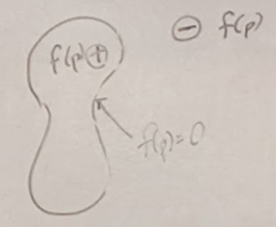

## Blobby shapes cont

### Implicit Primitives
- Spheres
- Segments
- triangle, quads
- box
- Sum to produce objects

### Render Implicits
- ray tracing
  - blobby primitive is some f(p)
  - 
  - very slow
- convert to polygons
  - iso surface extraction problem
    - iso => "same value"
  - 
### Marching Cubes
- Most common iso extraction method
- Draw grid around object
- inside of object f(p) > 0
- outside of object f(p) < 0
- Test at line intersections
- 
- Next need to analyze in detail
#### 2D Marching Squares
  - 
  - linear interpolate between points in and out of surface to estimate where f(p) is 0
  - connect interpolated points (in blue)
  -
#### 3D case
- use corners of a cube (8 points)
- 15 total cases
  - 
- Connecting Cubes together
  - 

### Dual Contouring
- another iso surface extraction method
- dual:
  - vertices <--> faces
- allows us to get sharp features
- using gradients to make an approximation pretending to extend out in direction of the gradients
- Use intersection points to create points instead of interpolation
- 
- if you get gradient info from more than two, numerical challenges need to be overcome to consolidate the info
