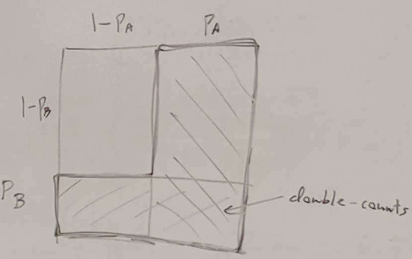

## Random Number Techniques

### Probability Review
- probability of event p: 0 <= p <= 1
  - ex chance of pokeball catching pokemon
  - chance that treasure chest that has gold
- probability of not p: (1 - p)
  - 
- probability of two independent events, both happening: (A and B)
  - P<sub>A</sub> x P<sub>B</sub> (multiply)
- 
- probability of two independent events happening: (A or B)
  - P<sub>A</sub> + P <sub>B</sub> - P<sub>A</sub> x P<sub>B</sub>
  - (1 - P<sub>A</sub>) x (1 - P<sub>B</sub>)
  - 
- General Example
  - 

### RNG to control events:
```
float p = random();
if (p < 0.7)
    smallReward();
else if (p < 0.95)
    mediumReward();
else if (p < 0.5)
    largeReward();
```
- bad luck runs still possible

### Pseudo-Random Numbers
- Number Theory --> Prime numbers

### Linear Congruential Generator (LCG)
- break up a linear function with modulo
- Integer parameters
  - a, c, m
- Initial Seed: x<sub>0</sub>
- Next Number:
  - <sub>n+1</sub> = (a * x<sub>n</sub> + c) % m
- The sequence x<sub>0</sub>, x<sub>1</sub>, ... will repeat after m steps of:
  - m and c are relatively prime
  - (a - 1) divisible by all prime factor of m
  - (a - 1) divisible by 4 if m divisible by 4
- Ex m = 13, a = 20, c = 17
  - x<sub>0</sub> = 0
  - x<sub>1</sub> = (20 * 0 + 17) % 13 = 17 % 13 = 4
  - x<sub>2</sub> = (20 * 4 + 17) % 13 = 97 % 13 = 6
  - x<sub>3</sub> = 7
  - sequence = 0, 4, 6, 7, 1, 3, 12, 10, 9, 2, 5, 0, 4, 6, ...
- m is usually much larger and base 2
  - m = 2<sup>24</sup>, 2<sup>32</sup> 
- Full state of RNG is just x<sub>n</sub>
  - save this return to it later

### Two different random uses:
1. seed for world
2. menu that shows random user's worlds
- Save and load different random states to maintain consistency and being able to switch between different random processes that require different seeds

### Unity: Save Random State:
- Save state
```
Random.State old_state = Random.state;
```
- Return to old random state
```
Random.state = old_state;
```

### Mersenne Twister
- Based on Mersenne primes: form 2<sup>n</sup> - 1
- Fast and high quality
- More complicated than LCG
- State of RNG is large: 25 Kb

### Random Shuffle
- given list of items
- produce: shuffled list, items in new order
  - eg cards
- Shuffle Ex:
  - Original List
    - [0 1 2 3]
    - [0 1 3]
    - [0 1]
    - [1]
  - Shuffled
    - [ ]
    - [2]
    - [3 2]
    - [0 3 2]
    - [1 0 3 2]
- Don't need two lists
- Use end of list as shuffled part
  - Combined list
    - [0 1 <u>2 3</u>]
    - [0 1 <u>3</u> 2]
    - [<u>0 1</u> 3 2]
    - [0 1 2 3]
- Use Case
  - Rewards
  - s = small, m = medium, l = large
    - [s s s s s s s s m m l]
    - shuffle
    - save