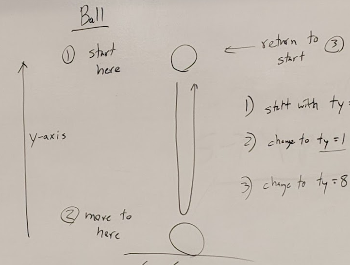
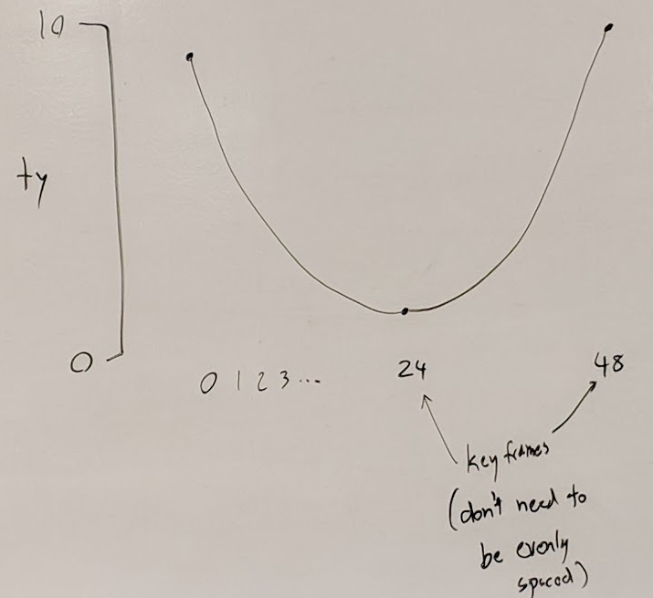
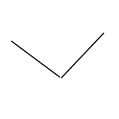
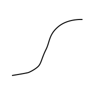
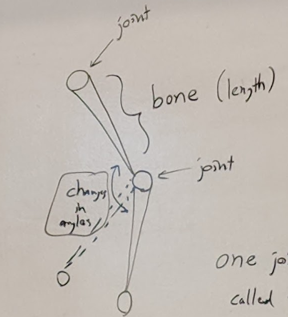
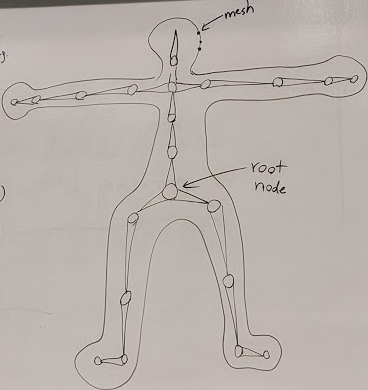
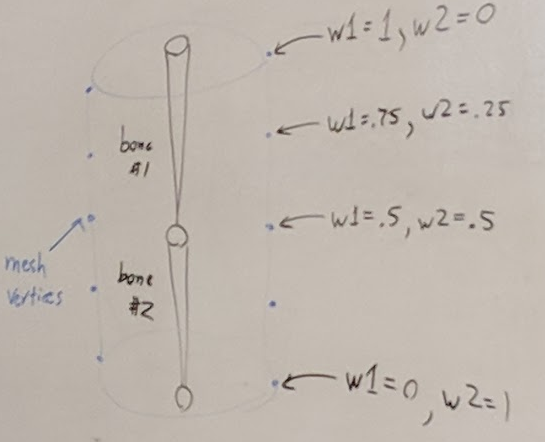
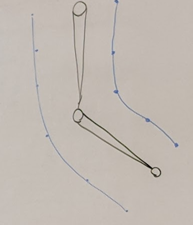
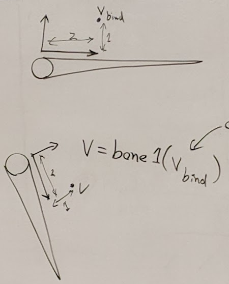

## Keyframe Animation
- Most basic way of animating on a computer
- Many aspects of a model can be animated:
  - position
  - orientation
  - color
  - anything with a number
- Animation examples:
  - bouncing ball
  - fading ghost
- Channel: a single numeric value that can change over time
  - ex y coordinate of a position
### Ball example
- 
1. start with ty = 8 at frame 0
2. change ty = 1 at frame 24
3. change ty = 8 at frame 48
- 
- Interpolating channel values between keyframes:
  - Catmull Rom Spline (above)
  - Linear interpolation
    - 
  - Ease in / Ease out
    - 

### Humans and Animals
- Articulated Models
  - models with joints
- use a skeleton (rig): made of bones and joints
  - joint: a position and an orientation
  - bone: two joints and the length between them
  - 
  - Root joint: the position it set directly
  - Rigging: creating joints and bones tied to a mesh by skinning
  - Bind (neutral) pose: for skinning
- 

### Skinning
- mesh points associated with bones
- 
- Weights: values on vertices that determine how much the motion of a bone affects the position of a vertex
- 
- Coordinate frame
  - v = bone1(vbind)
  - vbind: original position of vertex
  - New vertex position is the weighted sum of positions realative to the bones:
  - v' = w1 * bone1(vbind) + w2 * bone2(vbind)
  - 