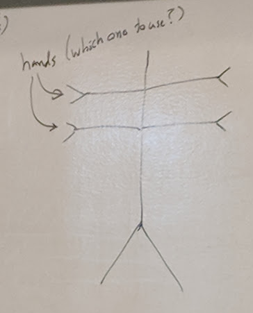
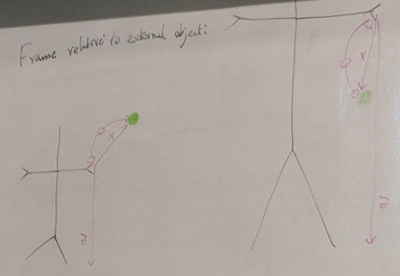

## Key Frame Animation, Part Deux
### Forward Kinematics
- Directly change joint orientations
- 
  - Rotates around Joint 2 
  - Everything outward (from root) is affected
### Inverse Kinematics
- Drag a joints position
- System solves for joint angles
- 
- IK issues:
  - Often more than one solution - need to find good one
  - Solving can require sophisticated algorithm
  - Slower than forward kinematics

## Spore Creature Animation
- Animating a character you have never seen

### Character motions
- Exs
  - Reaching for fruit
  - pound ground
  - clap

### Select Body Part(s)
- Typical Biped ("Rest Pose")
  - 
- Permutation: 4 arms
  - 
- Semantics: Give body parts capabilties:
  - grasper (hand)
  - foot
  - mouth
  - spine
  - root
- Animator specifies capabilities of parts to move
- Ex
  - Animator wants grasper
  - maybe 2 or 4 parts
  - animator narrows list with _spatial query_
- Spatial Query:
  - front/center/back
  - left/center/right
  - top/center/bottom
  - Top and Left
    - 
    - Relative to the whole body
  - Top and Left
    - 
    - Relative to all graspers

#### Local Coordinate frames
- Animator wants creature to wave
  - 
- Actual creature is of a different scale
  - 
- 2D Example of solution
  - 
- Animator selects whether an animation scales with body size
- Relative to the ground
  - 
- Relative to External object
  - 

### Reference Paper
- "Real-Time Motion Retargeting to Highly Varied User-Create Morphologies"
- Heckler et al., Siggaph 2008