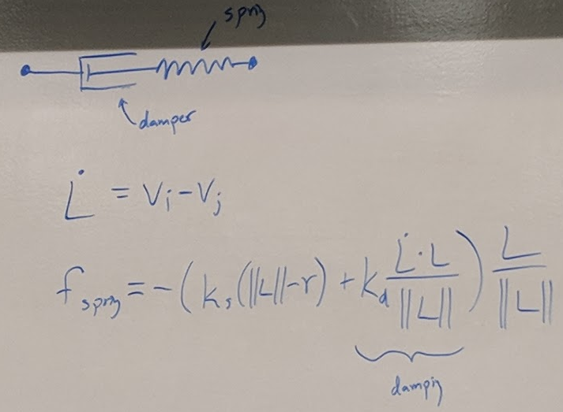

## Particle Systems
- Particle Animation

### Examples
- Fire
- Water
- Explosions
- Plants
- Flocking

### Creating a simulation
- Components
  - State
  - Integrator: How to take old states and update them to get next state

### Particle State
- State per particle
  - Mass (m)
  - Position p = (p<sub>x</sub>, p<sub>y</sub>)
  - Velocity v = (v<sub>x</sub>, v<sub>y</sub>)
- System State: List of many particles
- Time moves forward in small steps Δt

### Particle Simulation Loop
```
for each timestep:
    for each particle i:
        determine force f i on particles
        calulate new velocity and position from f sub i
        Draw particle at position p sub i
```

### Forces on a Particle System
- Wind
- Spring forces
- Attraction to near particles
- Repulsion
- damping

### General Order of Integration
1. Force
2. Acceleration
3. Velocity
4. Position

#### Differential Equations
- dv / dt = a(t)
- dp / dt = v(t)
- Forward Euler Integration: 
  - integration: new v, new p
  - v' = v + Δt * a(t)
  - p' = p + Δt * v(t)

### Adding foreces to Differential Equations
- Gravity
  - a<sub>grav</sub> = (0, g)
  - vector pointing down 
- Damping
  - Resistance to moation in media (air, fluid)
  - f<sub>damp</sub> = -k<sub>d</sub>v
  - k<sub>d</sub> = damping coefficient
  - high value, more damping
- Spring Force
  - r = rest length 
  - L = P<sub>i</sub> - P<sub>j</sub>
    - Vector point from P<sub>j</sub> to P<sub>i</sub>
    - Can separate into length ||L|| and direction L / ||L||
  - f <sup>i</sup><sub>spring</sub> = -k<sub>s</sub> (||L|| - r) * (L/||L||)
    - Hooke's Law
    - f <sup>i</sup><sub>spring</sub> = -f <sup>j</sup><sub>spring</sub>
    - k<sub>s</sub> = spring constant
- Spring with Damping
  - 