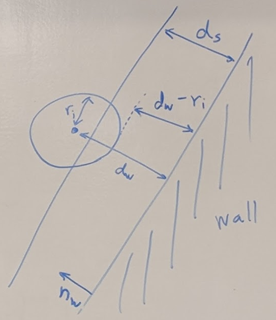
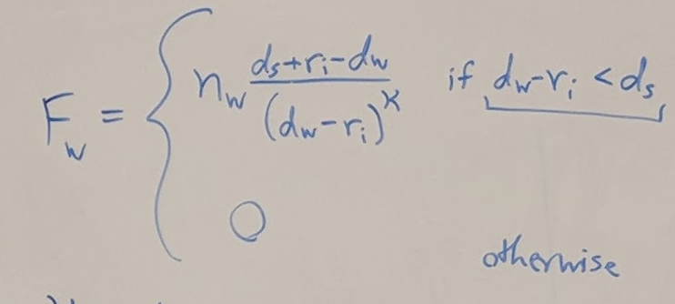
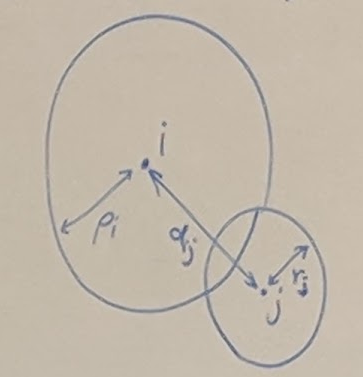
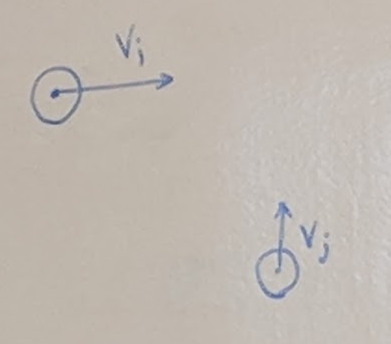
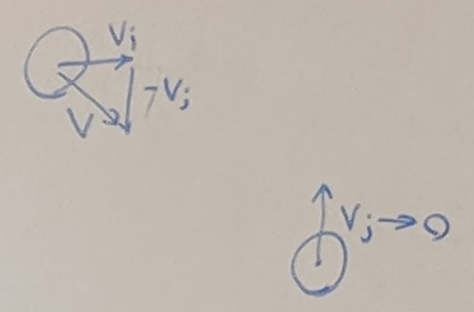
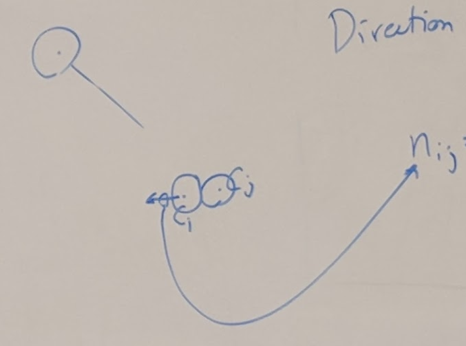
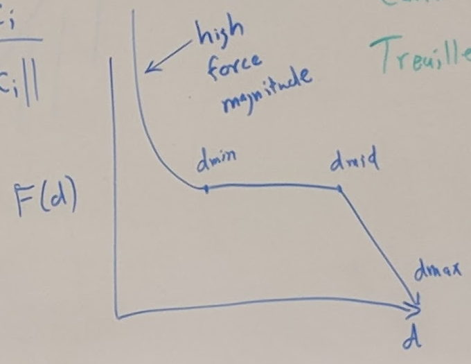
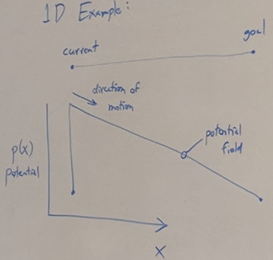
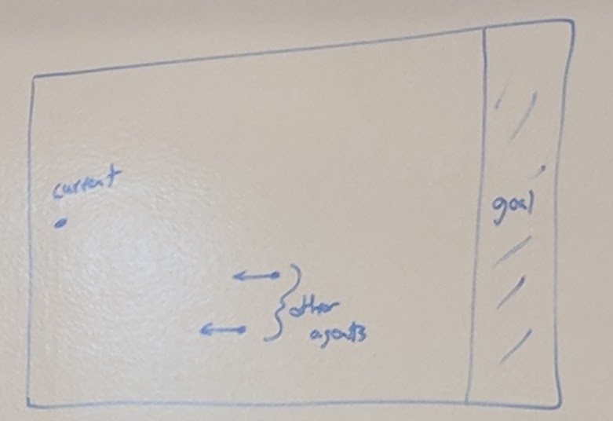
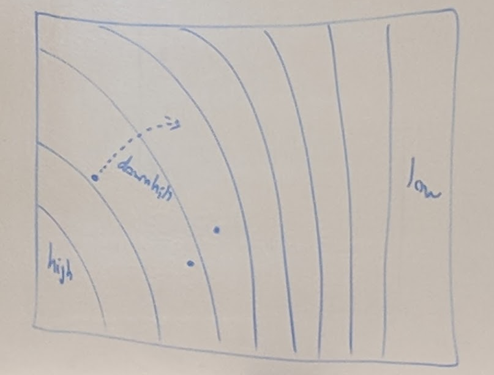

## Crowds
- pedestrians in steets
- armies
- concerts
- emergency escape

### Differ from flocks:
- entirely 2D positions for planning
- characters have a goal location(s)
- may be tightly packed
- not necessary to align with neighbor
- lane formation

### Two approaches
1. Agent based
2. Continium methods/Potential field 

### Agent State
- State data
  - position (xi)
  - orientation (θi)
  - velocity (vi)
  - radius (ri)
- Forces on agents
  - attraction to goal
  - repulsion from obstacles (walls)
  - avoidance of other agents
### Goal Attraction
  - xi --ni--> gi (goal)
  - ni = (gi - xi) / ||gi - xi||
  - Fg = τ-1 (uini - vi)
    - τ is typical time to reach speed preference
    - ui is speed preference
    - vi is current velocity
### Wall Avoidance
- ds = agent's prefered dist to wall
- dw = shortest distance to wall
- nw = normal to wall
- 
- 
- K = steepness of reulsion

### Avoid other agents
- ρi = comfortable distance to other agents
- dij = distance between agents i and j
- collision occurs if dij <= ρi + rj
- 
- Assume agents i and j are moving in straight line
- vi and vj velocities
- 
- Will they collide?
- Use relative velocities: v = vj - vi
- 
- Equations
  - Position of agent i at time t:
    - x'i = xi + tv
  - Collision occurs when:
    - ||xj - (xi + tv)|| = ρi + rj   
- Make list of 2 to 5 agents that will collide with agent i soonest
  - Let ci and cj be positions of agents when they would collide
- Direction to avoid:
  - 
  - nij = (cj - ci) / ||cj - i||
- Force Profile F(d)
  - 
  - when distance is very close together, exponential force
  - When distance is near to close, near constant force
  - when distance is beyond close, force drops off linearly

### Contium Method

- Create Potential field for groups
  - artificial height field
- Characters want to walk "downhill"
- 1D example
  - current *--------* goal
  - 
- 2D : potential field on grid
- 
- 
  - equipotential lines
  - a character knows based on fields to travel along path of least resistance
- Lane Formation
  - 
  - Fields are updated around agents
  - lanes form when low areas form in between high areas and agents follow behind others

### Papers
- "A Predictive Collision Avoidance Model for Pedestrian Simulation"
  - Karamonzas et al., Int'l Workshop on Motion in Games, 2009
- "Continuum Crowds"
  - Treuille et al., Siggraph 2006
