## Traffic
- Grand Theft Auto
- Sim City
- Cities: Skylines

### Traffic Animation Issues
- Car following
  - One car should not run into the one in front of it
- Lane Changing
  - Many paper
- Intersections
  - Almost entirely ignored in literature

### Sources and Destinations of cars
- Home
- Work, School, etc
- restaurant, shop

### Tiled Streets
- Cases:
  - Straight: 2 orientations
  - 
  - Fourway intersection
  - 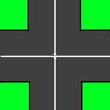
  - Turn: 4 orientations
  - 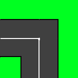
- Handling decisions:
  - Only decision need to make is at intersection
  - Once decided whether to turn or go straight
  - Reuse behaviour from straight and turn
- Queues: Each straight or turn tile has 2 queues
  - Straight:
    - 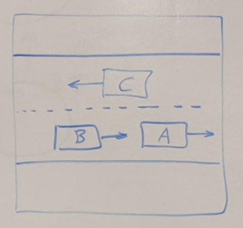
    - East bound queue: A, B
    - Westbound queue: C
    - 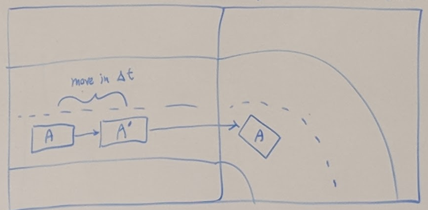
    - When car leaves queue of one tile, it enters queue of next tile
- Labeling of tiles:
  - Turns
  - 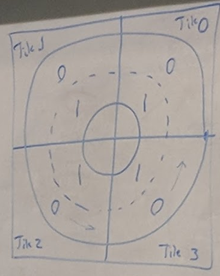
  - 4 Turn tiles
  - 2 queues per tile: 0 (inner) and  1 (outer)
  - Straight
  - 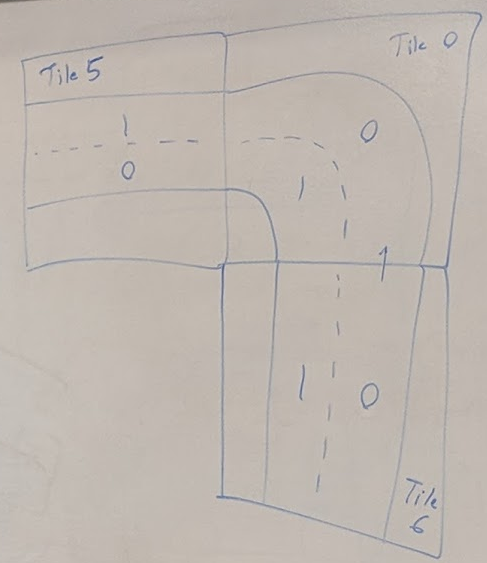
  - 4 way
  - 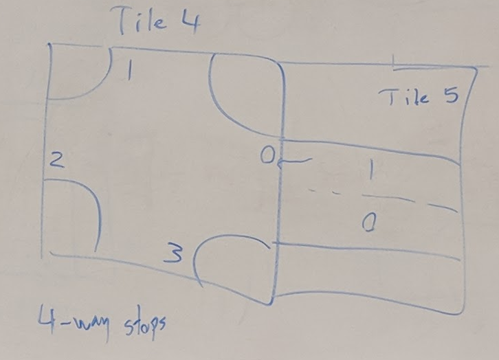

### Connection Table
| In Tile | Out Tile | Queue In | Queue Out |
| ---     | ---      | ---      | ---       |
| 6       | 0        | 0        | 0         |
| 5       | 0        | 0        | 1         |
| 5       | 4        | 1        | 0         |
- Queue Out is the answer to which queue to enter
- Queue out for tile 4: stop at what point in the intersection?

### Intersection Handling
- 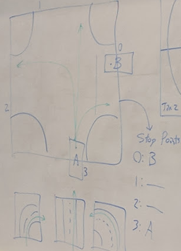
- One car at a time has right-of-way
- first come, first serve
- Store cars in list (queue): A, B
- 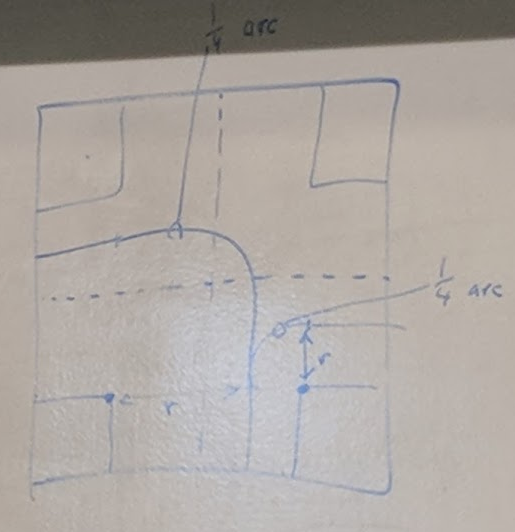
- Arcs for the car to follow along

### Speed of Car:
- desired Velocity
- position andvelocity of lead car
#### IDM - Intelligent Driver Model

| Symbol            | Meaning           | Common Values |
|---                |---                |---            |
| v                 | current velocity  | 100+-20km/h   |
| vd     | desired velocity  | 2.5+-1m       |
| smin   | min safe dist     | 3+-1m/s       |
| amax   | max acceleration  | 2.3+-1m/s     |
| bcom   | comfortable decel | 2.2+-1m/s     |
| T                 | driver reaction time | 1+-0.5s    |

- Each car calculates current safe distance to next car
- 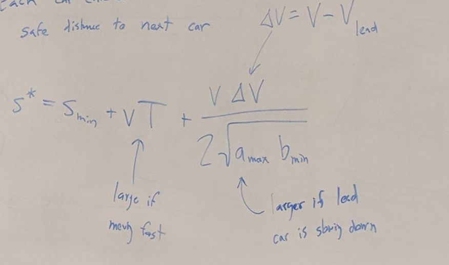
- New acceleration is the combination of 2 items:
- 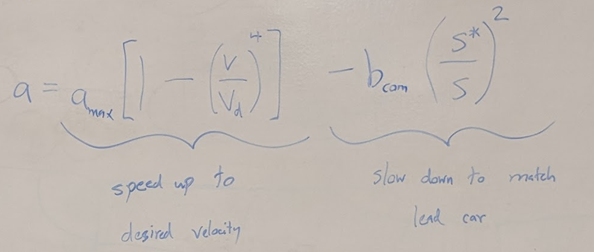
