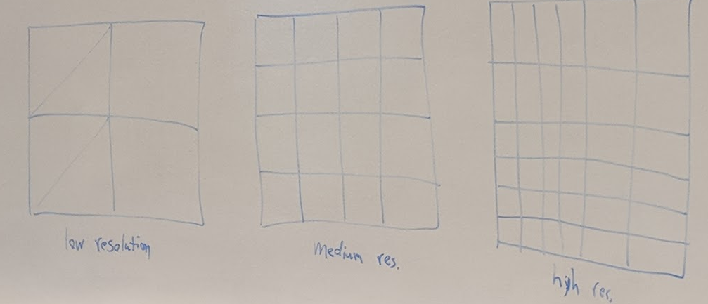
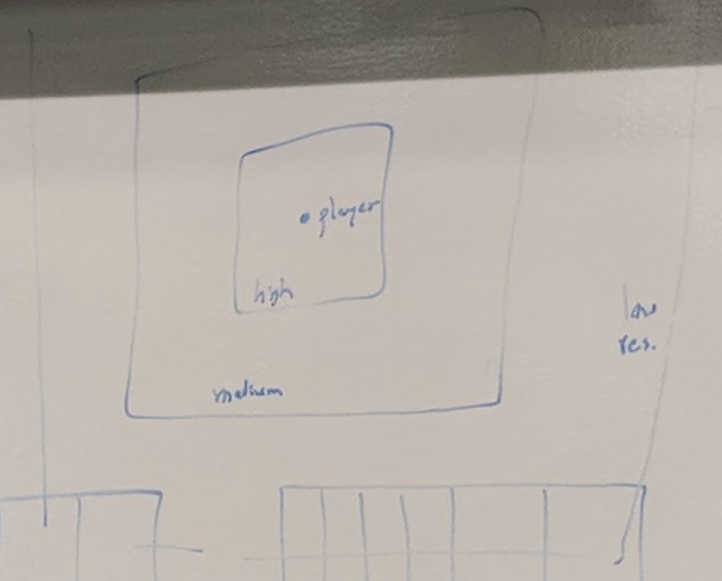
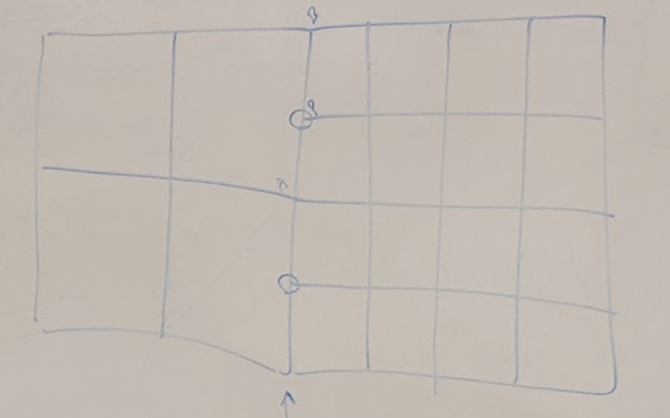
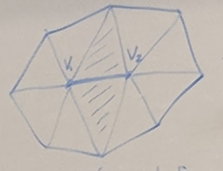
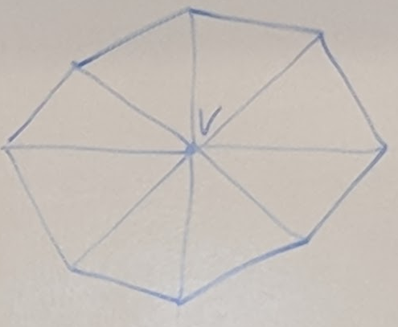
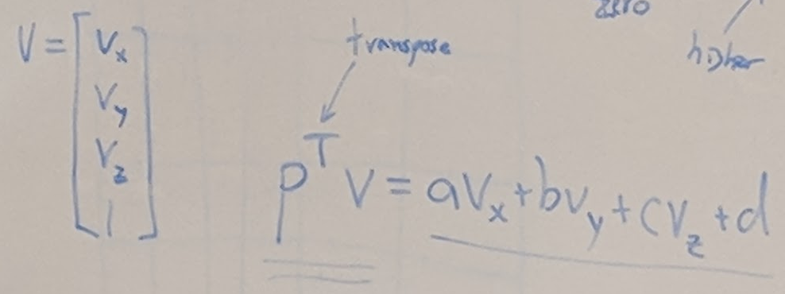
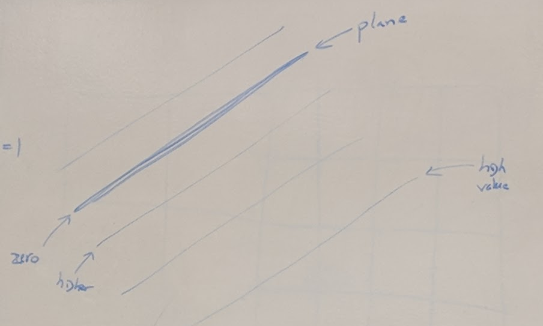
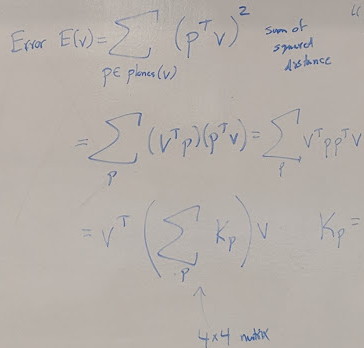
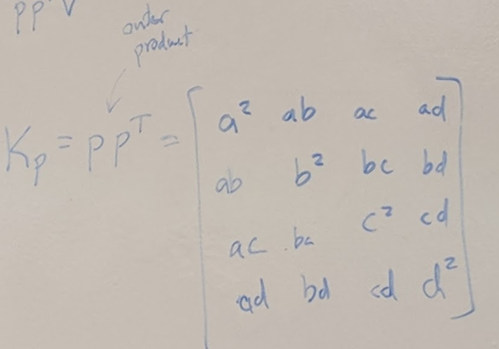
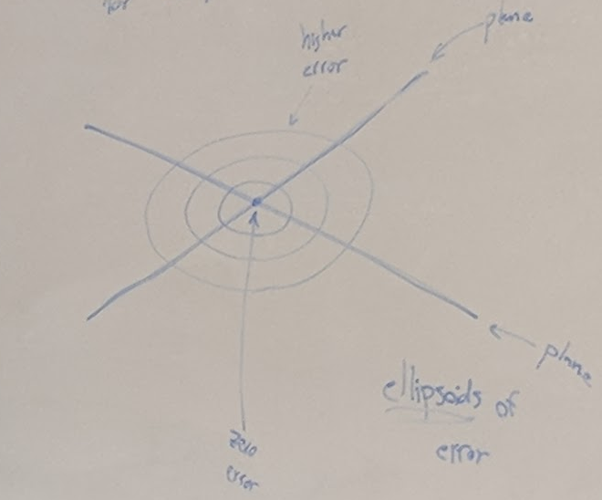

## Graphics Optimizations
- Draw Fewer Polygons

### Level of Detail (LOD)
- Have low, medium, and high resolution versions of model
- Pick which one to draw based on distance / screen size

### Terrain LOD
- 
- Typically have setup like the following:
- 
- Shiftin the LOD as you go
- Need to avoid cracks
  - Suppose we have a transition between high resolution and a lower resolution
  - 
  - If edges do not line up, a crack forms
  - Need to force the vertices to match
  - The y position must match to avoid the crack
- What about creating tiles on a planet?
  - Latitude/Longitude (ECP)
    - Produces weird shapes
  - Healpix
  - QuadCube
    - Most used in games
  - Google S2 Scheme
    - Split sphere into 6 faces
    - S2 cells
    - Space filling Hilbert Curve
- What about non primitive shapes?
  - Artist created in some cases
  - What about automatically?

### Mesh Simplification
- Approach
  1. Start with Detailed mesh
  2. Rank the vertices of the mesh based on their visual importance
  3. Remove vertices (based on importance) [fill the gaps left behind]
- "Surface Simplification Using Quadric Error Metrics"
  - Garland and Jeckbert, Siggraph 1997
  - Based on Edge Contraction
- Edge Contraction
  - Before Contraction
    - 
  - After
    - 
  - Create a vertex between the two, remove 1 vertex (2 -> 1)
  - Reomve the originals, remove 2 triangles
  - Where should the new vetex go specifically?
  - Possibilities:
    - At midpoint: v' = (v1 + v2) / 2
    - Meausre squared distance of v to planes of adjacent polygons
      - Equation: ax + by + cz + d = 0
      - Plane give by P = [a b c d] (column)
      - a2 + b2 + c2 = 1
        - Unit Length
      - The distance of V to a given plane
        - 
      - Single Quadric Error
      - 
- Error of Vertex / Quadric Error Measure
  - 
  - Sum of Square Distance
  - Kp has form of:
  - 
  - Can get Error for each plane
  - Add them all together to get Single 4x4 matrix Q to hold all info about distances to plane
  - Sum of 2 quadric matrices for 2 planes:
    - 
    - Ellipsoids of error
- Using Error
  - Minium Error is at the center of the ellipsoid
  - New Vertices place at centers of quadric ellipsoids
- Full Algorithm:
  1. Create quadric matrix for each possible edge contraction
  2. Find best new position v for vertices of each edge (center of ellipsoids)
  3. Measure erro for proposed v's, and rank them in priority queue
  4. Perform edge contractions (repeatedly from the lowest error edges in queue)
  5. Stop when mesh gas desired number of polygons
