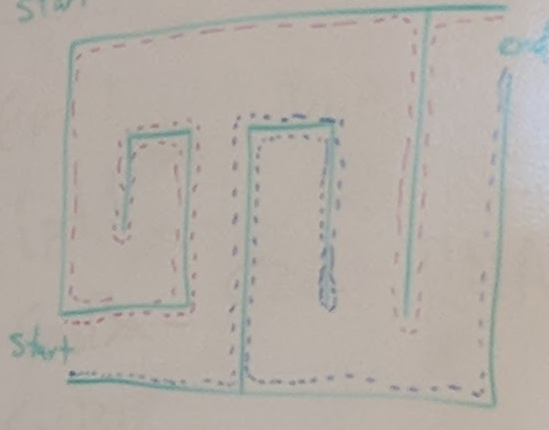
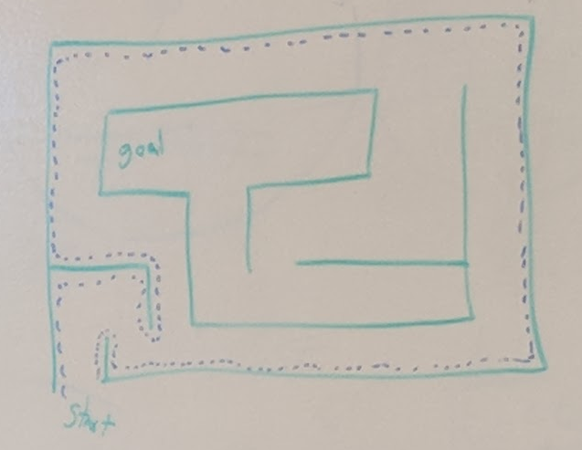
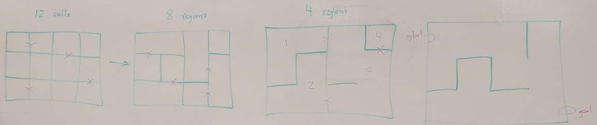
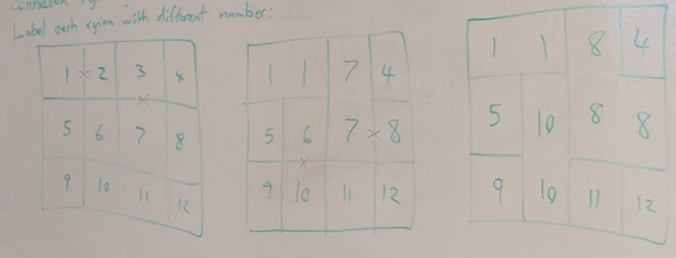
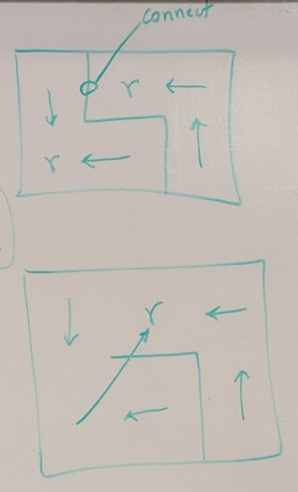

## Mazes
- Olin Shivers

### Classes
- Unicursal: Oldest mazes were one path
  - had no branch points
  - 
- Simply connected
  - Start and end on boundary
  - 
- Multiply connected mazes
  - conntected maze has detached islands
  - Goal is in interior
  - 
  - Hand-on-wall strategy will fail

### Flexible Maze Creation
1. Start with many isolated cells
2. Break down walls between connected components
- Example:
  - 
- Key: Kock down walls that connect separate regions

### Sloppy Implimentation
- We need to track connected regions
- 
1. Label each region with a different number
2. Choose walls to knock down
3. Verify that numbers on either side are different
4. Pick arbitrariy which number gets replaced by the other
5. Replace all cells with picked number with other number

- Know we need to knock down N-1 walls

### Wall Selection
1. Randomly select wall
  - Check to see if it separates 2 different regions
  - Wasteful
2. Make a list of all walls
  - Randomly shuffle that list

### Union-Find Description
- each region has one "root" cell (r)
- all other cells in connected regions have pointers that (maybe indirectly) point to root (-->)
- Check to see if two cells are in same region:
  - find their roots and compare (same root?)
- Union (connect) two regions by making or causing one of the regions roots to point to other regions root
- pointer along a chain are updated to take shorter path to root
- 
- Union operation is essentially constant time
