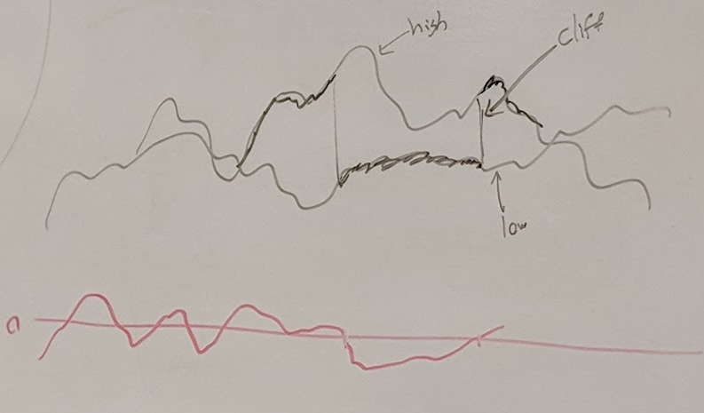
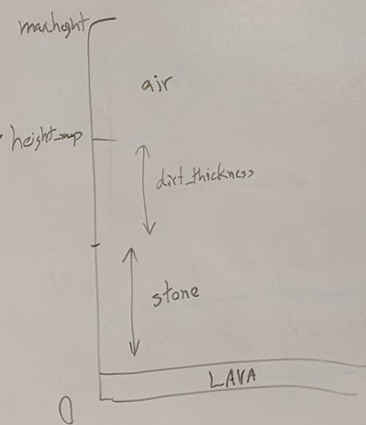

## Minecraft: Case Study

### History
- Markus "Notch" Persson
- Inspirations: Dwarf Fortress
- Released in 2009, out of beta in 2011, frequently updated
- Microsoft bought Mojang for $2.5 billion

### Details of the game
- Sandbox style game
- Styles of play
  - Creative
  - Survival
- Everything created by one seed
- Blocks 1<sup>3</sup> m
- Materials: dirt, iron ore, wood
- Craft: wood -> planks -> sticks -> wooden axe

### World
- Regular cubic 3D grid
- Layers:
  - air
  - grass
  - dirt
  - stone
  - ores
  - lava
  - bedrock
- Cave generation separate from terrain generation

### Region types: Biomes
- desert, plains, seasonal forest, desert, rainforest, savanna, swamp, taiga, tundra, ice desert
- Biome distribution also generated
- Biome Distribution:
  - Whittaker Diagram
  - random temperature + precipitatoin from perlin noise
  - 
- Implementation
``` c
if (temp < 0.1) return tundra;
if (temp < 0.7 && precip > 0.5) return swamp
...
```

## Classic Minecraft Generation

### Noise Functions
- 2D noise: noise(x,y) -> float [-1, 1]
- Octave noise: sum multiple 2D noise functions (octanves)
  - each octave has 2 x amplitude + 1/2 frequency of the prior
  - eg noise of octave 8 will give ϵ [-128, 128]
- Combined noise: noise1(x + noise2(x + noise2())

### Map Creation (height)
- waterLevel = 32
- noise1: combined with 8 octive components
- noise2: combined with 8 octive components
- noise3: single octave 6 funcion - higher frequency
``` c
low  = noise1(x,z) / 6 - 4; // smaller
high = noise2(x,z) / 5 + 6; // larger
if (noise(x,z) < 0)
    height = low;
else
    height = high;
heigh *= 0.5;
if (height < 0)
  height *= 8 / 10.0; // ???
height_map[x,z] = height + waterLevel;
```
- Resulting noise graph
- 

#### Create Strata
- `dirt_thickness = noise(x,z) / 24 - 4`
- 

### Caves
- carved out tunnels
- Spherical coordinates
``` c
length = random() * 200; // LCG 
theta = random() * 2 * PI;
phi = random * 2 * PI;

for (i = 0; i < length; i++)
{
  x += sin(theta) * cos(phi);
  y += cos(theta) * cos(phi);
  theta += dt * 0.2; // Change theta slowly
  dt = (dt * 0.9) + random() - random();
  // fill blockmap with air at x,y,z
}
```

### Ore Veins
- Like caves (tube), but with iron, coal, etc

### Lakes and Lava Lakes
- Carved out of surface blocks

### Generated structures
- Mountains, hilss, beach, river
- Minshafts, stronghold, buildings
