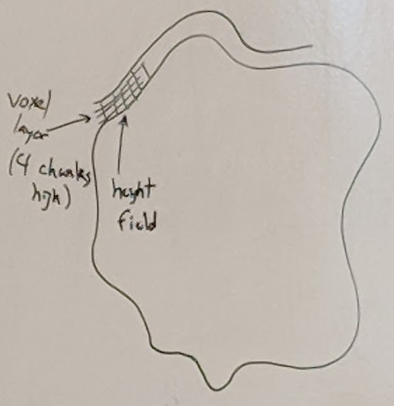
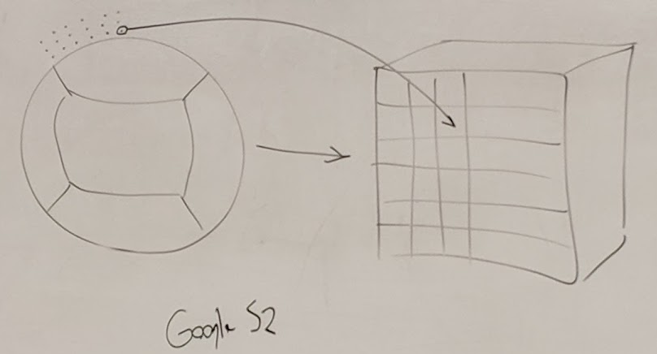
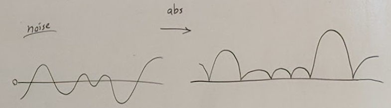
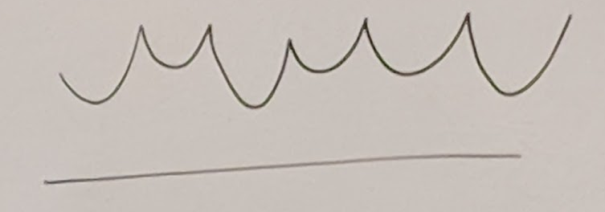

## Case Study: No Man's Sky
- Planet exploration
- Release in August 2016

### Procedurally Generated
- terrain
- creatures
- vehicles
- plants

### Terrain
- Planet: 64-bit seed
- 2<sup>64</sup> = 1.8 * 10<sup>19</sup>, or 18 quintillion planets
- Planet Terrain Components
  1. 3D voxel grid for terrain (not height field) using noise
  2. Voxels only in thing shell
  3. Sphere to cube projection (for storage)
  4. Post-noise decorations
  5. Multiple noise techniques used

### 3D Voxel Grid
- Terrain <---> Voxels
- Each voxel = 1 cubic meter
- Voxel material type: grass, rock, sand, etc
- Stored in 36x36x36 voxel chunks:
  - represent 32x32x32 region
  - Use extra voxels to overlap between chunks to avoid cracks
  - Only chunks near the player are loaded
- Each voxel contains 6 bytes of info
  - density (2 B), 2 material types (2 B), material blends (2 B)

### Terrain Shell
- Voxels present in layer 128 voxels thick (4 chunks high)
- This rides on top of low frequency noise layer (height field)
    - Used to give high mountains and deep oceans
    - Can have difference between low and high be around 1 km
- 

### Sphere to cube
- Vocels calculated in curved grid over sphere
- For storage, projected onto cube
- Inflated cube
- 

### Decoration
- New terrain features
  - Rocks
  - Rock worms
  - Caves
  - Pillars
  - plants
  - etc
- Inorganic features done in voxels

### Noise Techniques
- Sum of Perlin noise octaves
- Billow: sharp valleys using absolute value function
  - 
- Ridged Noise: upside down billow
  - 
- Domain Warping: add noise to input position
  - Creates "folds" in terrain pattern
``` c
float octave_noise(vec2 p); // classic octaves of Perlin

float warp_noise(vec2 p) {
    float dx = 5.2;
    float dy = 1.3;
    vec2 q = vec2(octave_noise(p), octave_noise(p + vec2(dx, dy)));
    return octave_noise(p + 4 * q);
}
```

### Creatures
- walk, fly, swim
- Usual graphics methods
  - mesh, skeleton rigs
- Artist creates base model for creature
  - base rig for animation
  - mesh geometry (zbrush)
- Bone Scaling system
  - changes rig (varies legs and neck)
- Animation rigs shared between various creature types
  - Archetypes:
    - Quadrapeds: "Cows", "horses", "antelope
    - Aquatic: "Sharks", "whales"
- Decorations:
  - Fins, spikes, horns, dorsal horns, etc
- Large texture library:
  - scales, fur, feathers, plates, ...

### Plants
- Start with trunk
- Branch out
- Leaves and other features

### Vehicles
- Easier because cockpit always in the same spot

### References
- "Continuous World Generation"
  - Innes McKendrick, GDC 2017
- "Building Worlds using Math"
  - Sean Murray, GDC 2017
- "Procedural Art"
  - Grant Duncan, GDC 2015
